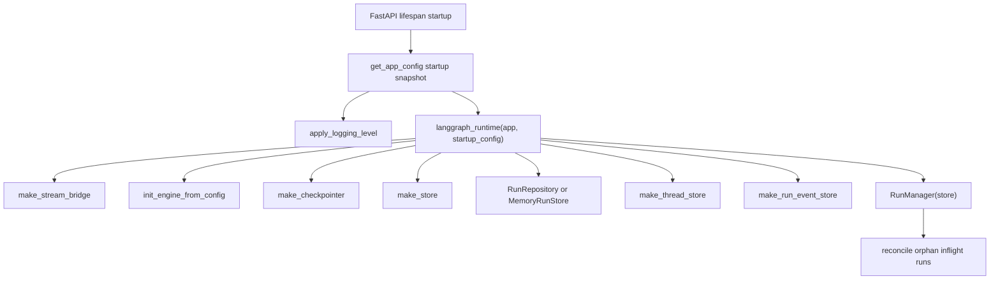
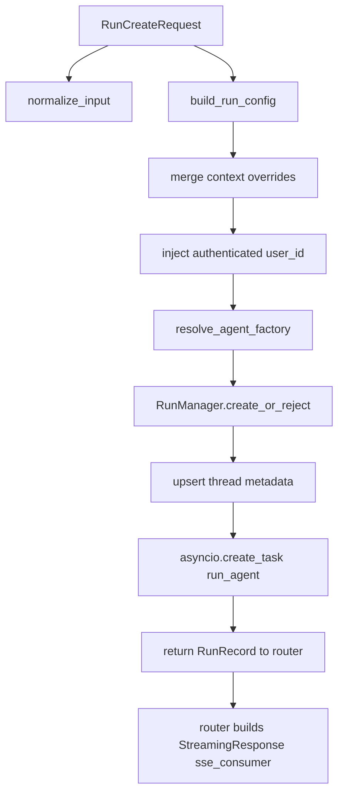
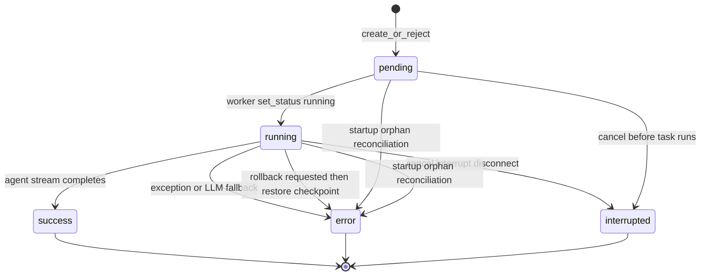

<title>02｜Gateway 与 LangGraph 运行时详解</title>

<callout emoji="✅">
**本章目标：** 从 HTTP 请求进入 Gateway 开始，讲清 run 如何被创建、如何后台执行、如何通过 SSE 回到前端。
</callout>

## 本轮源码校准补充：Gateway 到 RunManager 的真实链路

<callout emoji="✅">
**源码结论：**浏览器默认请求 `/api/langgraph/*`，nginx 将其 rewrite 到 Gateway `/api/*`。一次 stream run 会落到 `thread_runs.stream_run()`，再进入 `services.start_run()`、`RunManager.create_or_reject()` 和后台 `run_agent()`。
</callout>

```mermaid
flowchart TD
  Browser[/api/langgraph/threads/:id/runs/stream] --> Nginx[nginx rewrite to /api]
  Nginx --> Router[thread_runs.stream_run]
  Router --> Service[services.start_run]
  Service --> Validate[model allowlist + owner check]
  Validate --> Manager[RunManager.create_or_reject]
  Manager --> Task[asyncio background run_agent]
  Router --> SSE[sse_consumer StreamingResponse]
  Task --> Bridge[StreamBridge.publish]
  Bridge --> SSE
```

| 代码入口 | 说明 |
|-|-|
| `docker/nginx/nginx.local.conf` / `docker/nginx/nginx.conf` | rewrite `/api/langgraph/*` 到 Gateway `/api/*`。 |
| `backend/app/gateway/routers/thread_runs.py` | 暴露 `POST /api/threads/{thread_id}/runs/stream`，返回 `text/event-stream` 与 `Content-Location`。 |
| `backend/app/gateway/services.py` | `start_run()` 负责模型白名单、owner check、config/context 构造、后台 task 启动。 |
| `backend/packages/harness/deerflow/runtime/runs/manager.py` | run 状态机；`enqueue` 当前是 schema 字段但不支持。 |
| `backend/packages/harness/deerflow/runtime/stream_bridge/memory.py` | in-process event buffer，支持 heartbeat、replay 和 end sentinel。 |


# 1. Gateway 模块地图

| 文件/模块 | 职责 | 重点函数 |
|-|-|-|
| `backend/app/gateway/app.py` | FastAPI app、lifespan、middleware、router 注册 | create_app、lifespan、\_ensure_admin_user |
| `backend/app/gateway/deps.py` | 运行时单例初始化和依赖获取 | langgraph_runtime、get_run_context、get_config |
| `backend/app/gateway/services.py` | run lifecycle 业务层 | start_run、build_run_config、sse_consumer |
| `backend/app/gateway/routers/thread_runs.py` | thread scoped runs API | create_run、stream_run、wait_run、join |
| `backend/app/gateway/routers/runs.py` | stateless runs API | stateless_stream、stateless_wait |
| `backend/app/gateway/routers/threads.py` | thread CRUD/state/history | create/search/get state/history/delete |
| `backend/app/gateway/routers/{models,mcp,skills,memory,uploads,artifacts}.py` | 管理 API | 前端 settings 和 artifact 面板调用 |

# 2. Runtime 初始化逻辑



# 3. start_run 细节




# 4. Run 状态机与低并发语义

`RunManager` 只允许同一 thread 上存在有限的 active run。`multitask_strategy=reject` 会在已有 `pending/running` run 时返回 409；`interrupt` / `rollback` 会先给旧 run 设置 abort，再创建新 run；`enqueue` 虽然是请求模型字段，但当前 `RunManager.create_or_reject()` 不支持，会返回 501。



| 触发点 | 源码行为 |
|-|-|
| active run + `reject` | `RunManager.create_or_reject()` 抛 `ConflictError`，router 返回 409。 |
| active run + `interrupt` | 旧 run 标记 interrupted、设置 abort、取消 task；新 run 进入 pending。 |
| active run + `rollback` | 旧 run 标记 abort_action=`rollback`；worker 捕获取消后恢复 pre-run checkpoint，并把旧 run 记为 error。 |
| SSE 断开 + `on_disconnect=cancel` | `sse_consumer()` 在 finally 中调用 `run_mgr.cancel()`。 |
| Gateway 重启后遗留 active row | startup reconciliation 把无本地 task 的 `pending/running` 持久化 run 标为 error。 |

# 5. SSE 消费逻辑

`services.py::sse_consumer` 订阅 `StreamBridge`。后台 `run_agent` 发布 values、messages、custom、metadata、end 等事件；前端 LangGraph SDK 消费这些事件并驱动 UI。

```http
POST /api/langgraph/threads/{thread_id}/runs/stream
# nginx rewrite -> /api/threads/{thread_id}/runs/stream
# router -> services.start_run -> runtime.runs.worker.run_agent
```

# 6. 修改建议

- 改 API 形状：先看 router 的 Pydantic model，再看 `backend/app/gateway/services.py` 是否需要同步。
- 改运行时生命周期：先看 `deps.py::langgraph_runtime`，确认是否属于 startup-only 配置。
- 改 SSE：同时检查后端 `format_sse/sse_consumer` 和前端 `useThreadStream` 回调。

---

# 补充：设计取舍、重点代码与阅读路径

<callout emoji="💡">
**设计目的：**Gateway 内嵌 LangGraph runtime，是为了减少独立 LangGraph Server 部署复杂度，同时保留兼容 API。
</callout>

| 维度 | 说明 |
|-|-|
| 收益 | 收益是部署简单、状态统一；代价是 Gateway 进程职责更重，启动期单例边界更重要。 |
| 代价 | 见收益说明中的代价部分；此章节采用收益与代价合并描述。 |
| 重点代码 | 重点代码：`backend/app/gateway/services.py`、`backend/app/gateway/deps.py`、`backend/packages/harness/deerflow/runtime/runs/worker.py`。 |
| 阅读路径 | 阅读路径：router 只接请求，services 建 run，worker 真执行。 |

```mermaid
sequenceDiagram
  participant W as run_agent
  participant RM as RunManager
  participant B as StreamBridge
  participant C as Checkpointer
  participant J as RunJournal
  participant TS as thread_store
  W->>J: init from event_store
  W->>RM: set_status running
  W->>C: aget_tuple pre-run snapshot
  W->>B: publish metadata
  W->>W: make_lead_agent build agent
  loop agent.astream
    W->>B: publish values messages custom
  end
  alt abort rollback
    W->>C: aput restore pre-run checkpoint
    W->>RM: set_status error
  else normal finish
    W->>RM: set_status success or error
  end
  W->>J: flush token usage
  W->>RM: update_run_completion
  W->>TS: update_display_name and status from checkpoint
  W->>B: publish_end
  W->>B: cleanup delay 60s
```

