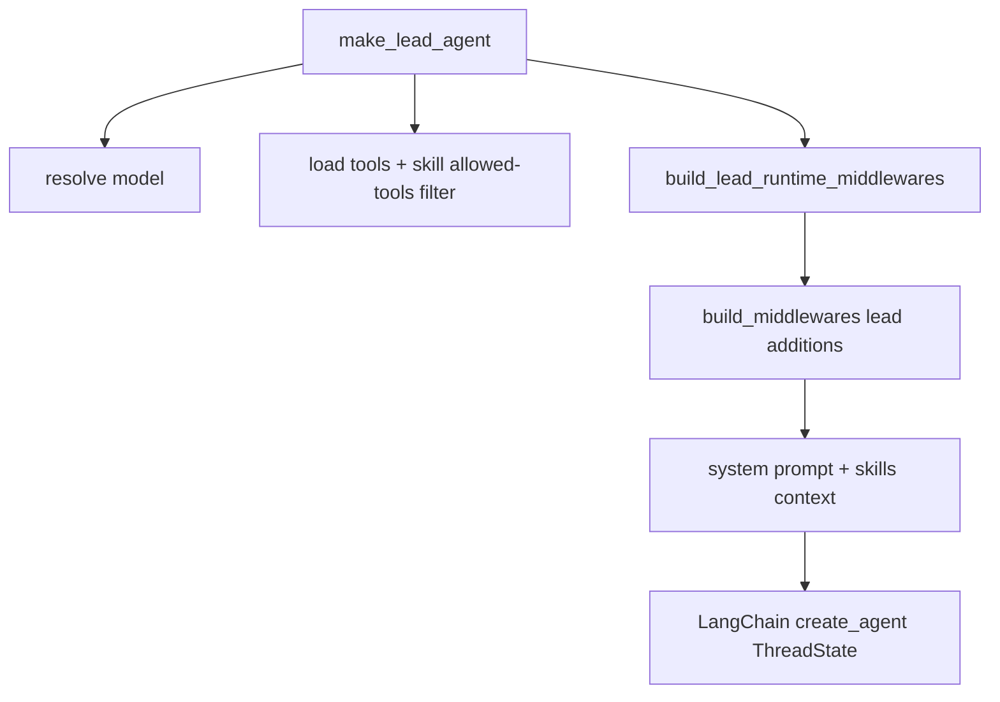
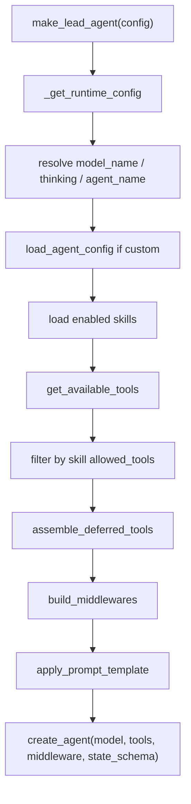
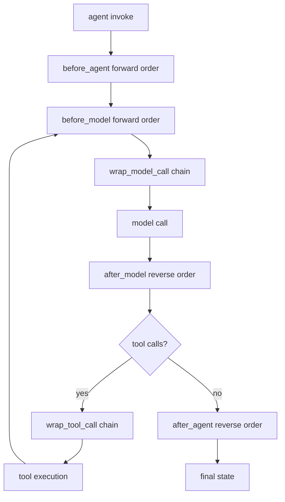
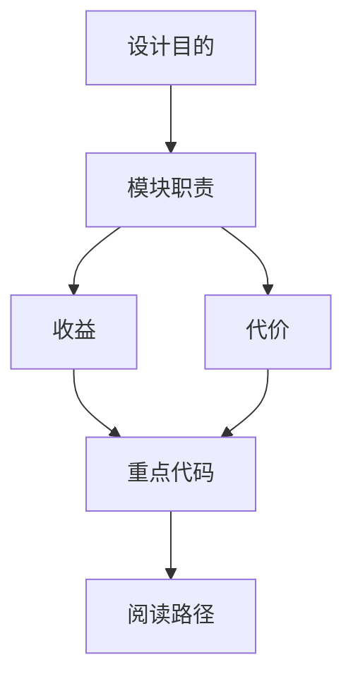

<title>03｜Lead Agent、Prompt、Tools 与 Middleware 详解</title>

<callout emoji="✅">
**本章目标：** 讲清 `lead_agent` 不是一个单文件逻辑，而是“模型 + tools + prompt + middleware + state_schema”的组合产物。
</callout>

## 本轮源码校准补充：Lead Agent 与 middleware 装配顺序

<callout emoji="⚠️">
**源码结论：**不要把 middleware 简化成固定 5 个。真实链路是 base runtime middlewares 先组装，lead-agent 再追加动态上下文、skills、summary/todo/token/title/memory/deferred/subagent/loop/safety/clarification 等能力。
</callout>



| 阶段 | 代表内容 |
|-|-|
| Base runtime | ToolOutputBudget、ThreadData、Uploads、Sandbox、DanglingToolCall、LLMErrorHandling、Guardrails、SandboxAudit、ToolErrorHandling。 |
| Lead additions | DynamicContext、SkillActivation、Summarization、Todo、TokenUsage、Title、Memory、ViewImage、DeferredToolFilter、SubagentLimit、LoopDetection、SafetyFinishReason、Clarification。 |
| 配置来源 | `configurable` 与 `context` 都可能携带 model/mode/thinking/plan/subagent/reasoning/thread 信息。 |


# 1. make_lead_agent 组装流程



# 2. ThreadState 状态模型

| 字段 | 含义 | 谁会读写 |
|-|-|-|
| `messages` | LangChain/LangGraph 对话消息 | agent core、MessageList |
| `sandbox` | 当前 thread sandbox_id | SandboxMiddleware、sandbox tools |
| `thread_data` | workspace/uploads/outputs 物理路径 | ThreadDataMiddleware、UploadsMiddleware |
| `artifacts` | 产物虚拟路径列表 | present_files/write tools、前端 Artifacts |
| `todos` | plan mode Todo 列表 | TodoMiddleware、前端 TodoList |
| `viewed_images` | 视觉模型图片上下文 | ViewImageMiddleware |
| `promoted` | deferred tool search 已提升工具 | DeferredToolFilterMiddleware |

# 3. Middleware 顺序与职责

| Middleware | 职责 |
|-|-|
| `ToolOutputBudgetMiddleware` | 限制工具输出大小，超大输出落盘并返回预览 |
| `ThreadDataMiddleware` | 创建 thread workspace/uploads/outputs 路径 |
| `UploadsMiddleware` | 把上传文件信息注入上下文 |
| `SandboxMiddleware` | 获取 sandbox 并持久化 sandbox_id |
| `DynamicContextMiddleware` | 注入当前日期和 memory reminder |
| `SkillActivationMiddleware` | 显式 /skill-name 时读取完整 SKILL.md |
| `SummarizationMiddleware` | 上下文过长时摘要 |
| `TodoMiddleware` | plan mode 下提供 todo 管理 |
| `TitleMiddleware` | 自动标题 |
| `MemoryMiddleware` | after_agent 异步更新 memory |
| `SubagentLimitMiddleware` | 限制并发 task tool calls |
| `ClarificationMiddleware` | 最后拦截澄清请求 |

# 4. Middleware 执行阶段



# 5. 新同学调试入口

```text
backend/packages/harness/deerflow/agents/lead_agent/agent.py
backend/packages/harness/deerflow/agents/lead_agent/prompt.py
backend/packages/harness/deerflow/agents/thread_state.py
backend/packages/harness/deerflow/agents/middlewares/
```

- [ ] 能说明 pro/ultra 模式如何影响 is_plan_mode 和 subagent_enabled。

- [ ] 能说明 ClarificationMiddleware 放在最后的原因。

---

# 补充：设计取舍、重点代码与阅读路径

<callout emoji="💡">
**设计目的：**Lead Agent 采用 factory 组装模型、tools、skills、middleware，是为了让运行时能力按配置动态拼装。
</callout>

| 维度 | 说明 |
|-|-|
| 收益 | 收益是扩展灵活；代价是问题可能来自模型、工具、prompt 或 middleware 任一层。 |
| 代价 | 见收益说明中的代价部分；此章节采用收益与代价合并描述。 |
| 重点代码 | 重点代码：`backend/packages/harness/deerflow/agents/lead_agent/agent.py`、`backend/packages/harness/deerflow/agents/lead_agent/prompt.py`。 |
| 阅读路径 | 阅读路径：先看 make_lead_agent 的输入 config，再看 create_agent 的四件套。 |

