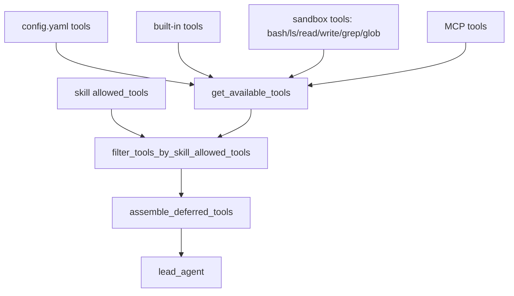
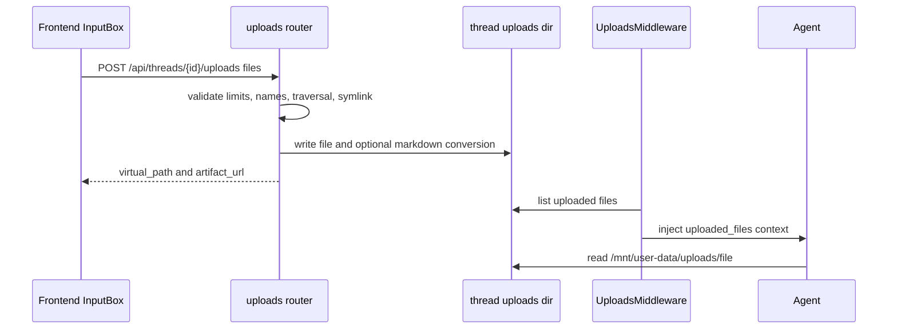
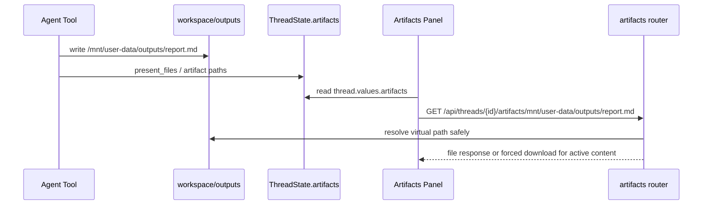
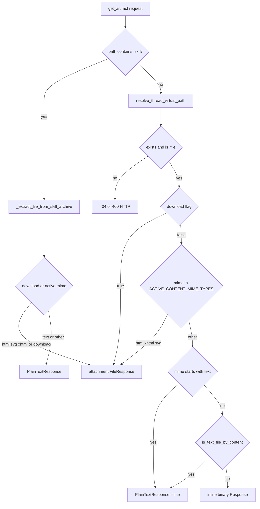

<title>04｜Tools、Sandbox、Uploads 与 Artifacts 详解</title>

<callout emoji="✅">
**本章目标：** 讲清 Agent 如何获得文件系统和命令能力，用户上传文件如何进入 agent，agent 产物如何回到前端。
</callout>

# 1. Tool 来源



# 2. Sandbox 路径映射

DeerFlow 暴露给 agent 的路径是虚拟路径，后端再按 thread 解析到真实目录。调试文件问题时不要把 `/mnt/user-data/...` 当成本机绝对路径；它会经由 `ThreadDataMiddleware` / sandbox path helpers 映射到当前 thread 的 workspace、uploads、outputs 目录。

```mermaid
flowchart LR
  Agent[agent sees virtual path] --> Prefix{prefix}
  Prefix -->|workspace| Workspace[thread workspace path]
  Prefix -->|uploads| Uploads[thread uploads path]
  Prefix -->|outputs| Outputs[thread outputs path]
  UploadAPI[uploads router] --> Uploads
  UploadAPI --> UploadVirtual[/mnt/user-data/uploads/name]
  ToolWrite[write or present files] --> Outputs
  Outputs --> ArtifactVirtual[/mnt/user-data/outputs/name]
  ArtifactVirtual --> ArtifactAPI[/api/threads/:id/artifacts/path]
  UploadVirtual --> ArtifactAPI
  ArtifactAPI --> SafeResolve[resolve_thread_virtual_path]
  SafeResolve --> Delivery[inline safe files or attachment for HTML/SVG]
```

| 虚拟路径 | 典型来源 | 解析/消费方 |
|-|-|-|
| `/mnt/user-data/workspace/*` | agent 工作区读写 | sandbox tools path replacement 与 bounds check |
| `/mnt/user-data/uploads/*` | 用户上传文件 | uploads manager 生成 virtual_path；UploadsMiddleware 注入上下文 |
| `/mnt/user-data/outputs/*` | agent 产物、外置工具输出 | artifact panel 与 artifacts router 读取 |

安全边界是“只允许解析到当前 thread 的 workspace/uploads/outputs 下”。artifact router 还会对 HTML/XHTML/SVG 等主动内容强制 attachment，避免预览时执行脚本。


# 3. Uploads 数据流



# 4. Artifacts 数据流



# 5. 安全边界

| 风险点 | 防护 | 相关文件 |
|-|-|-|
| Local bash | 默认禁用；`allow_host_bash` 开启后仅适合可信本地环境 | `sandbox/security.py` |
| 路径穿越 | 限制可访问虚拟路径，拒绝危险路径 | `sandbox/tools.py`、`uploads/manager.py` |
| 主动内容 | HTML/SVG/XHTML artifact 强制 attachment 下载 | `routers/artifacts.py` |
| 并发写文件 | str_replace 使用文件操作锁 | `sandbox/file_operation_lock.py` |

# 6. 关键文件

```text
backend/packages/harness/deerflow/tools/tools.py
backend/packages/harness/deerflow/sandbox/tools.py
backend/packages/harness/deerflow/sandbox/middleware.py
backend/app/gateway/routers/uploads.py
backend/app/gateway/routers/artifacts.py
frontend/src/components/workspace/artifacts/
```

---

# 补充：设计取舍、重点代码与阅读路径

<callout emoji="💡">
**设计目的：**工具和文件系统分离为 sandbox、uploads、artifacts，是为了让 agent 既能操作文件又能被前端安全展示。
</callout>

| 维度 | 说明 |
|-|-|
| 收益 | 收益是路径语义清楚；代价是虚拟路径、物理路径、artifact URL 容易混淆。 |
| 代价 | 见收益说明中的代价部分；此章节采用收益与代价合并描述。 |
| 重点代码 | 重点代码：`backend/packages/harness/deerflow/sandbox/tools.py`、`backend/app/gateway/routers/uploads.py`、`backend/app/gateway/routers/artifacts.py`。 |
| 阅读路径 | 阅读路径：上传进入 uploads，agent 写 outputs，前端通过 artifacts 读。 |

