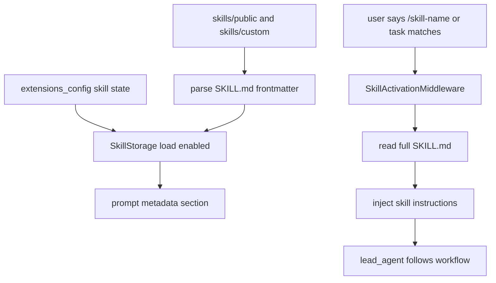
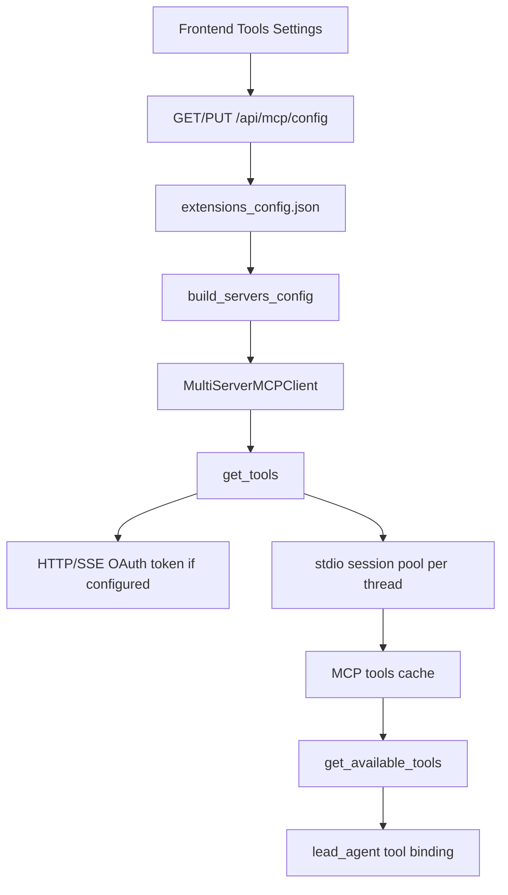
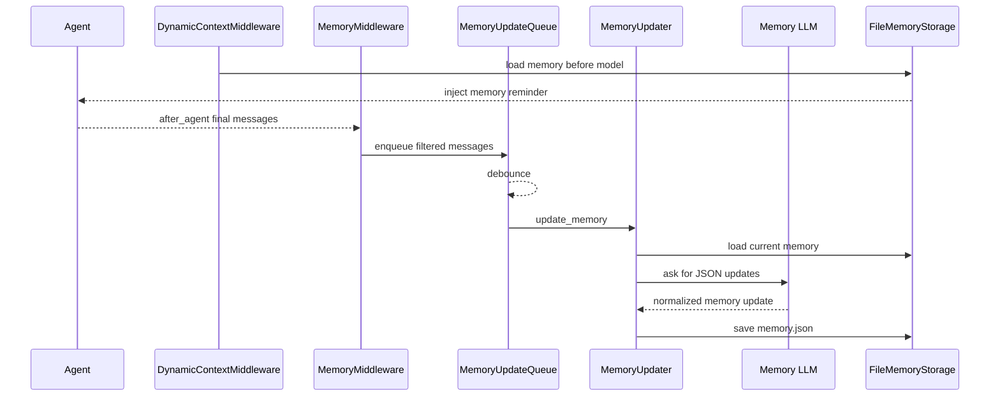
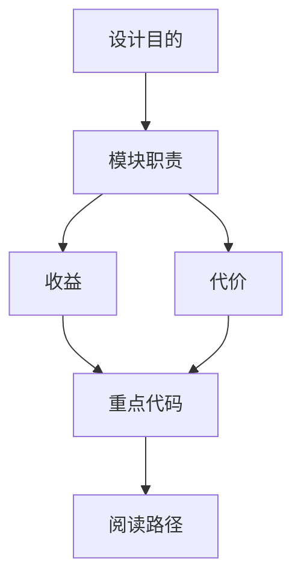

<title>05｜Skills、MCP 与 Memory 详解</title>

<callout emoji="✅">
**本章目标：** 讲清 DeerFlow 如何扩展 agent 能力：skills 负责“工作方法注入”，MCP 负责“外部工具接入”，memory 负责“跨会话上下文”。
</callout>

# 1. Skills 运行逻辑

# 2. MCP 工具发现逻辑

# 3. Memory 更新与注入

# 4. 模块对比

| 模块 | 核心价值 | 关键文件 | 前端入口 |
|-|-|-|-|
| Skills | 把稳定工作流写成可复用说明 | `backend/packages/harness/deerflow/skills/*` | `frontend/src/components/workspace/settings/skill-settings-page.tsx` |
| MCP | 接入外部工具和服务 | `backend/packages/harness/deerflow/mcp/*` | `frontend/src/components/workspace/settings/tool-settings-page.tsx` |
| Memory | 保存用户偏好和长期事实 | `backend/packages/harness/deerflow/agents/memory/*` | `frontend/src/components/workspace/settings/memory-settings-page.tsx` |

# 5. 常见修改路径

- 新增内置 skill：在 `skills/public/{name}/SKILL.md` 创建说明，并确认 parser 能读取 frontmatter。
- 调整 MCP 安全策略：先看 `routers/mcp.py` 的 stdio allowlist 和 secret mask。
- 调整 memory 内容质量：先看 `agents/memory/prompt.py` 与 `message_processing.py`。

---

# 补充：设计取舍、重点代码与阅读路径

<callout emoji="💡">
**设计目的：**Skills、MCP、Memory 分别解决方法复用、外部工具接入、长期上下文。
</callout>

| 维度 | 说明 |
|-|-|
| 收益 | 收益是能力可组合；代价是 prompt、工具 schema、记忆注入都可能影响模型行为。 |
| 代价 | 见收益说明中的代价部分；此章节采用收益与代价合并描述。 |
| 重点代码 | 重点代码：`backend/packages/harness/deerflow/skills/parser.py`、`backend/packages/harness/deerflow/mcp/tools.py`、`backend/packages/harness/deerflow/agents/memory/updater.py`。 |
| 阅读路径 | 阅读路径：Skills 是说明书，MCP 是工具箱，Memory 是用户画像。 |

