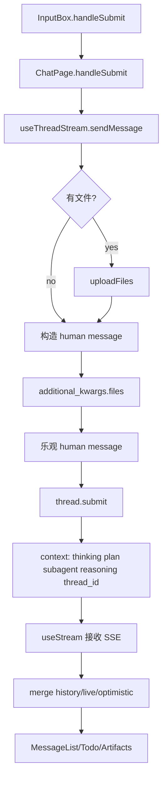
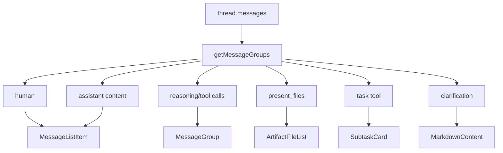
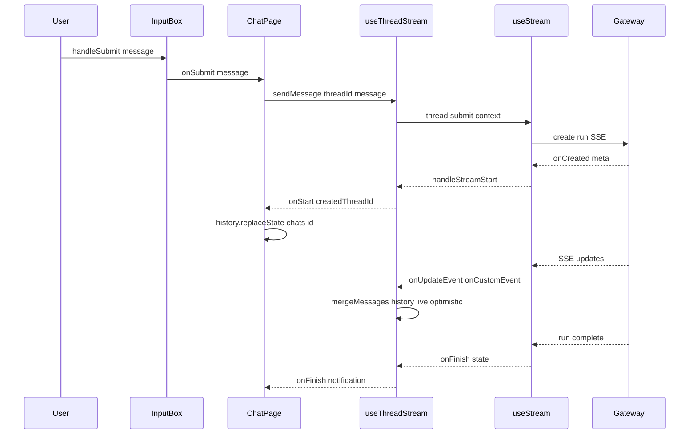

<title>06｜Frontend Workspace 与 Chat 主链路详解</title>

<callout emoji="✅">
**本章目标：** 从 Next.js route 到 LangGraph SDK streaming，讲清用户打开 /workspace/chats/new、发送消息、看到结果的全过程。
</callout>

# 1. Workspace 壳层

| 文件 | 职责 |
|-|-|
| `frontend/src/app/workspace/layout.tsx` | 服务端鉴权，决定进入 workspace、setup、login 或 offline fallback。 |
| `frontend/src/app/workspace/workspace-content.tsx` | 挂载 QueryClient、Sidebar、GatewayOfflineBanner、CommandPalette、Toaster。 |
| `frontend/src/app/workspace/page.tsx` | 默认跳转到 `/workspace/chats/new`。 |
| `workspace-sidebar.tsx` | 侧边栏和会话导航入口。 |

# 2. /new thread 生命周期

<callout emoji="💡">
**核心结论：**`/workspace/chats/new` 不是后端已经存在的 thread。前端先生成本地临时 UUID，等第一次消息真正提交并创建 run 后，再把 URL 替换成真实 thread id。
</callout>

```mermaid
flowchart TD
  NewRoute[/workspace/chats/new] --> UseThreadChat[useThreadChat]
  UseThreadChat --> TempUUID[生成本地临时 UUID]
  TempUUID --> ChatPage[ChatPage]
  ChatPage --> StreamHook[useThreadStream]
  StreamHook --> NoFetch[threadId undefined 避免提前拉 history]
  UserSend[用户第一次发送] --> SendMessage[sendMessage]
  SendMessage --> Submit[thread.submit]
  Submit --> Gateway[Gateway 创建 thread/run]
  Gateway --> OnStart[onStart createdThreadId]
  OnStart --> Replace[history.replaceState]
  Replace --> RealRoute[/workspace/chats/{threadId}]
```

| 阶段 | 源码 | 说明 |
|-|-|-|
| 识别 `/new` | `use-thread-chat.ts` | 根据 pathname 判断是否是新会话路径。 |
| 生成临时 ID | `useThreadChat()` | 给 UI 一个稳定展示用 UUID，但此时后端 thread 还不存在。 |
| 避免误拉历史 | `ChatPage -> useThreadStream` | 新会话时传 `threadId: undefined`、`displayThreadId: threadId`，避免 SDK 用临时 ID 拉后端历史。 |
| 第一次发送 | `InputBox -> ChatPage.handleSubmit` | 用户提交后才进入真实 stream/run 流程。 |
| URL 替换 | `onStart` | 后端返回真实 `createdThreadId` 后，ChatPage 用 `history.replaceState` 切到 `/workspace/chats/{id}`。 |

# 3. sendMessage 内部流程

<callout emoji="✅">
**核心结论：**真正提交消息的是 `useThreadStream.sendMessage`，不是 `useThreadChat`。`useThreadChat` 管 URL/thread 状态；`useThreadStream` 管 LangGraph SDK stream。
</callout>



| 步骤 | 源码 | 重点 |
|-|-|-|
| 输入校验 | `frontend/src/components/workspace/input-box.tsx` | 空文本、文件、stop streaming、模型自动选择。 |
| 页面提交 | `frontend/src/app/workspace/chats/[thread_id]/page.tsx` | `handleSubmit` 把 UI message 交给 `sendMessage(threadId, message)`。 |
| 文件上传 | `frontend/src/core/uploads/*` | 文件先上传到 Gateway，再把上传结果写进 human message metadata。 |
| SDK 提交 | `frontend/src/core/threads/hooks.ts` | `thread.submit(...)` 发送 messages、stream options、recursion limit 和 context。 |
| context 字段 | `useThreadStream.sendMessage` | 包含 `thinking_enabled`、`is_plan_mode`、`subagent_enabled`、`reasoning_effort`、`thread_id`。 |
| UI 合并 | `mergeMessages(...)` | 合并 history、live thread messages、optimistic messages，并按 identity 去重。 |

# 4. Streaming callback 与 UI 更新

| 回调 | 触发 | UI 结果 |
|-|-|-|
| `onCreated` | SDK 创建/确认 thread/run 元信息 | upsert thread cache，并调用 `handleStreamStart` 初始化运行态。 |
| `onUpdateEvent` | LangGraph update/custom state | 处理 summarization/title cache 等特殊事件；普通 messages/todos/artifacts 主要来自 `useStream` state。 |
| `onLangChainEvent` | LangChain events | 派发 tool end，用于任务状态。 |
| `onCustomEvent` | 自定义事件 | task_running 更新 SubtaskCard，llm_retry toast。 |
| `onStart` | 后端返回 createdThreadId/runId | ChatPage 替换 URL、把新会话切换成真实 thread。 |
| `onFinish` | run 完成 | 刷新会话列表、token usage、通知。 |
| `onError` | stream error | 清 optimistic、toast error。 |

# 5. MessageList 分组



---

# 补充：设计取舍、重点代码与阅读路径

<callout emoji="💡">
**设计目的：**前端把 ChatPage、useThreadStream、MessageList、InputBox 拆开，是为了分离页面装配、数据流和展示。
</callout>

| 维度 | 说明 |
|-|-|
| 收益 | 收益是职责清晰；代价是一次消息跨多个 hook 和组件。 |
| 代价 | 见收益说明中的代价部分；此章节采用收益与代价合并描述。 |
| 重点代码 | 重点代码：`frontend/src/app/workspace/chats/[thread_id]/page.tsx`、`frontend/src/core/threads/hooks.ts`、`frontend/src/components/workspace/input-box.tsx`。 |
| 阅读路径 | 阅读路径：InputBox 产出消息，useThreadStream 处理流，MessageList 消费状态。 |

