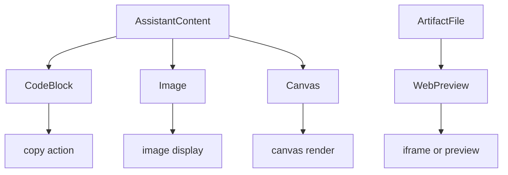

<title>104｜AI Elements CodeBlock、WebPreview、Canvas、Image 详解</title>

<callout emoji="✅">
**本章目标：**单独讲解该模块职责、输入输出和运行逻辑。
</callout>

| 模块点 | 说明 |
|-|-|
| code-block.tsx | 代码块展示、高亮和复制。 |
| web-preview.tsx | 网页/HTML 预览容器。 |
| canvas.tsx | Canvas 类 AI 产物展示。 |
| image.tsx | 图片元素展示。 |
| artifact.tsx | 与 artifact panel 形成更高层封装。 |

