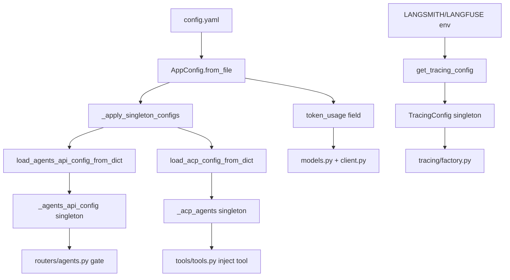

<title>109｜Tracing、TokenUsage、ACP 配置文件详解</title>

<callout emoji="✅">
**本章目标：**单独讲解该模块职责、输入输出和运行逻辑。
</callout>

| 模块点 | 说明 |
|-|-|
| tracing_config.py | 从环境变量读取 LangSmith/Langfuse 开关、key、project/endpoint/host，并缓存为 tracing singleton。 |
| token_usage_config.py | token usage display/tracking 开关。 |
| `backend/packages/harness/deerflow/config/acp_config.py` 配置段 | 从 `config.yaml` 的 `acp_agents` 加载外部 ACP agent 配置，非空时注入 `invoke_acp_agent` 工具。 |
| `backend/packages/harness/deerflow/config/agents_api_config.py` 配置段 | 从 `config.yaml` 的 `agents_api.enabled` 控制 `/api/agents` 管理路由是否允许访问。 |
| skill_evolution_config.py | 任务结束后 skill 自演化提示开关。 |

```mermaid
flowchart TD
  Env[environment variables] --> TracingConfig
  ConfigYaml[config.yaml] --> AppConfig
  AppConfig --> TokenUsageConfig
  AppConfig --> ACPAgents[acp_agents]
  AppConfig --> AgentsAPIConfig
  AppConfig --> SkillEvolutionConfig
  TracingConfig --> Callbacks[build_tracing_callbacks]
  TokenUsageConfig --> TokenUsageMiddleware
  ACPAgents --> InvokeACPTool[invoke_acp_agent tool]
  AgentsAPIConfig --> AgentsRouter[/api/agents guarded routes]
  SkillEvolutionConfig --> PromptSection[skill evolution prompt section]
```

---

# 补充：设计取舍、重点代码与阅读路径

<callout emoji="💡">
**设计目的：**前端按 route、core 数据层、业务组件、UI primitive 分层，是为了降低组件耦合。
</callout>

| 维度 | 说明 |
|-|-|
| 收益 | 收益是展示层和数据请求分离，组件更容易复用。 |
| 代价 | 代价是一次用户交互常跨页面、hook、缓存、上下文和组件。 |
| 重点代码 | 重点代码在 `frontend/src/app`、`frontend/src/core`、`frontend/src/components` 对应模块。 |
| 阅读路径 | 阅读路径：先找 route，再找 hook 数据源，最后看组件消费。 |

