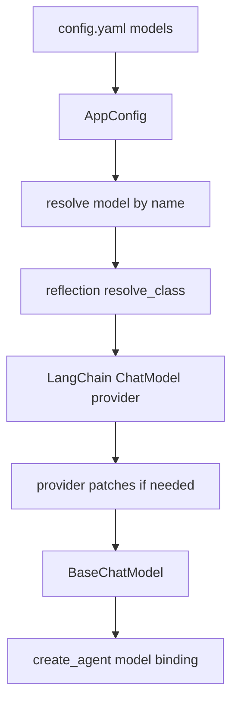
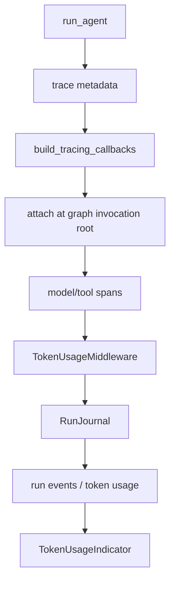
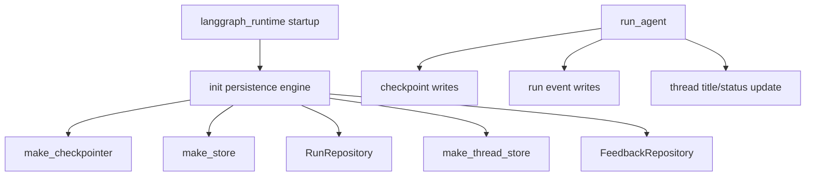
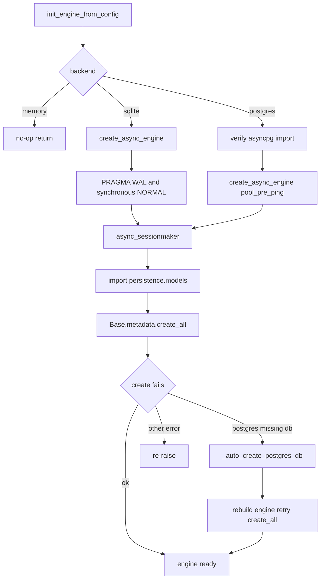

<title>10｜Models、Tracing、Persistence 与 Token Usage 详解</title>

<callout emoji="✅">
**本章目标：** 讲清模型如何从 config.yaml 变成 LangChain model，trace/token/persistence 如何贯穿一次 run。
</callout>

# 1. Model Factory

# 2. Tracing 与 Token Usage

# 3. Persistence 运行逻辑

# 4. 关键文件

| 模块 | 关键文件 |
|-|-|
| Model factory | `backend/packages/harness/deerflow/models/factory.py` |
| Provider patches | `backend/packages/harness/deerflow/models/patched_*.py` |
| Tracing | `backend/packages/harness/deerflow/tracing/factory.py` |
| Persistence engine | `backend/packages/harness/deerflow/persistence/engine.py` |
| Run journal | `backend/packages/harness/deerflow/runtime/journal.py` |
| Token UI | `frontend/src/components/workspace/token-usage-indicator.tsx` |

---

# 补充：设计取舍、重点代码与阅读路径

<callout emoji="💡">
**设计目的：**模型、追踪、持久化是 run 可观测与可恢复的基础。
</callout>

| 维度 | 说明 |
|-|-|
| 收益 | 收益是可切模型、可追 trace、可恢复状态；代价是配置和启动期资源复杂。 |
| 代价 | 见收益说明中的代价部分；此章节采用收益与代价合并描述。 |
| 重点代码 | 重点代码：`backend/packages/harness/deerflow/models/factory.py`、`backend/packages/harness/deerflow/tracing/factory.py`、`backend/packages/harness/deerflow/persistence/engine.py`。 |
| 阅读路径 | 阅读路径：模型负责推理，trace 记录过程，persistence 记录状态。 |

