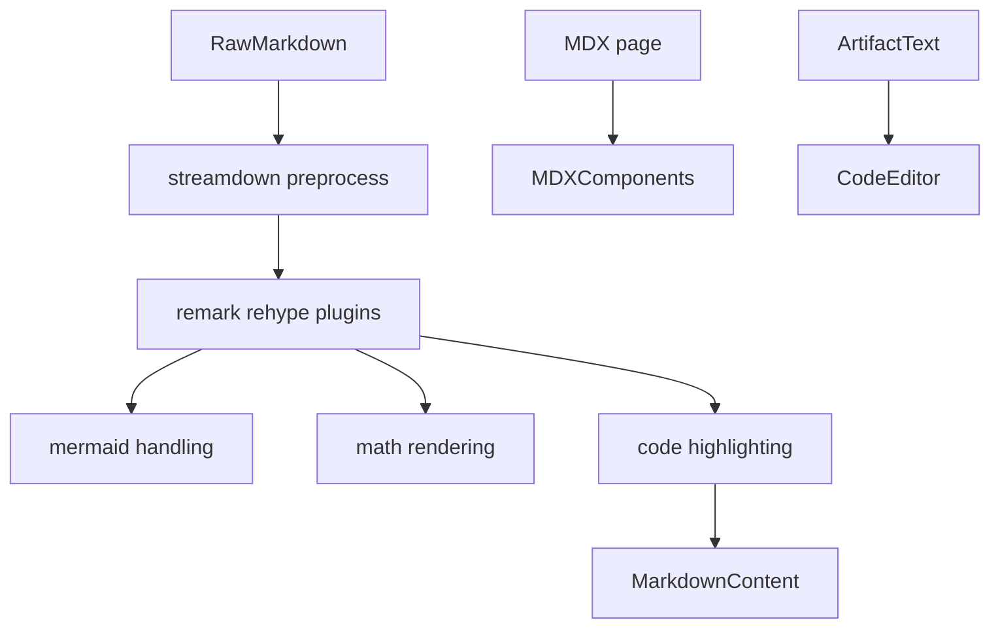
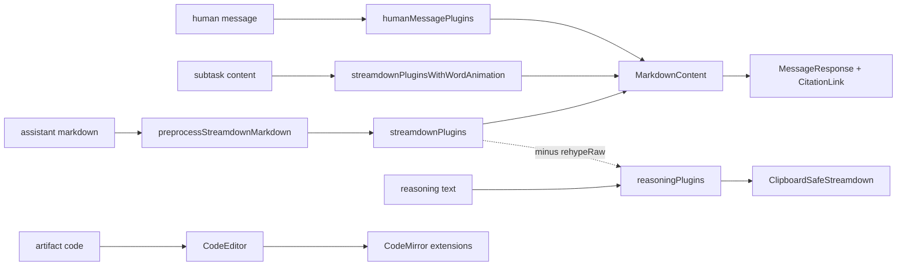

<title>110｜Frontend Streamdown、MDX、Markdown 渲染详解</title>

<callout emoji="✅">
**本章目标：**单独讲解该模块职责、输入输出和运行逻辑。
</callout>

| 模块点 | 说明 |
|-|-|
| core/streamdown | Markdown 预处理、插件、Mermaid 支持。 |
| markdown-content.tsx | workspace 消息 Markdown 渲染。 |
| mdx-components.ts | Nextra/MDX wrapper 组件。 |
| rehype | split words、KaTeX、raw HTML 等处理。 |
| code-editor.tsx | artifact 代码展示。 |

---

# 补充：设计取舍、重点代码与阅读路径

<callout emoji="💡">
**设计目的：**前端按 route、core 数据层、业务组件、UI primitive 分层，是为了降低组件耦合。
</callout>

| 维度 | 说明 |
|-|-|
| 收益 | 收益是展示层和数据请求分离，组件更容易复用。 |
| 代价 | 代价是一次用户交互常跨页面、hook、缓存、上下文和组件。 |
| 重点代码 | 重点代码在 `frontend/src/app`、`frontend/src/core`、`frontend/src/components` 对应模块。 |
| 阅读路径 | 阅读路径：先找 route，再找 hook 数据源，最后看组件消费。 |

