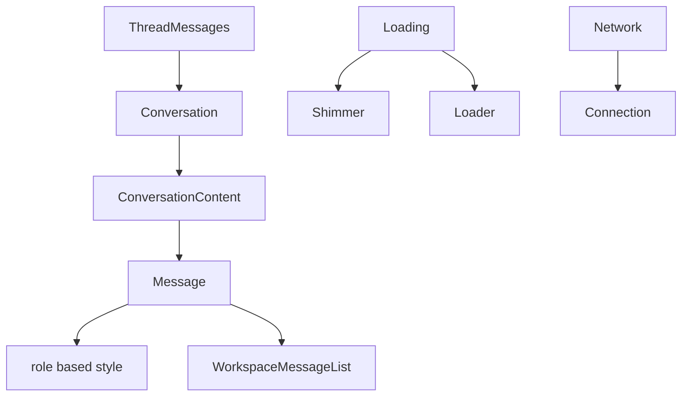

<title>111｜AI Elements Conversation 与 Message 详解</title>

<callout emoji="✅">
**本章目标：**继续按小模块解释职责、输入输出和运行逻辑。
</callout>

| 模块点 | 说明 |
|-|-|
| conversation.tsx | 会话滚动容器和布局。 |
| message.tsx | AI/user message primitive。 |
| shimmer/loader | 流式加载视觉反馈。 |
| connection | 连接状态提示。 |

