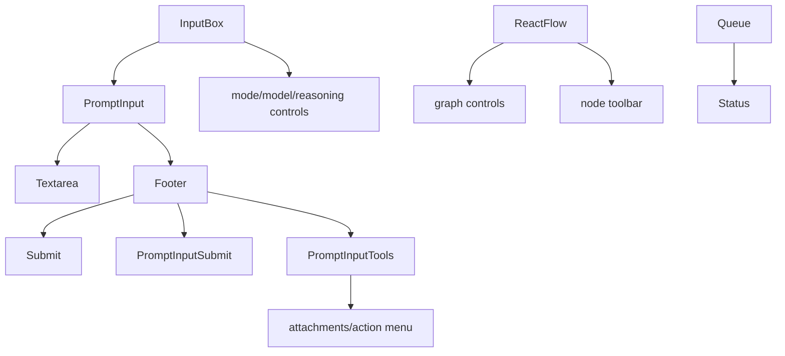
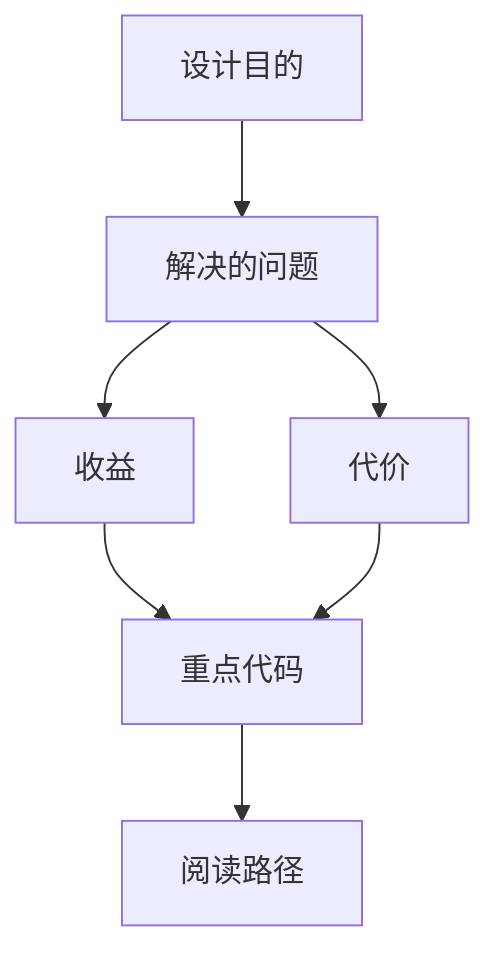

<title>112｜AI Elements PromptInput 与 Controls 详解</title>

<callout emoji="✅">
**本章目标：**继续按小模块解释职责、输入输出和运行逻辑。
</callout>

| 模块点 | 说明 |
|-|-|
| prompt-input.tsx | 输入框 primitive：textarea/footer/submit。 |
| prompt-input.tsx | 输入框 primitive，内部包含 textarea、footer、submit、attachment、action menu 和 controller/context。 |
| controls.tsx | React Flow graph controls primitive，不是聊天输入控制按钮。 |
| toolbar.tsx | React Flow NodeToolbar primitive，用于图节点工具条。 |
| queue.tsx | 排队/状态展示。 |

---

# 补充：设计取舍、重点代码与阅读路径

<callout emoji="💡">
**设计目的：**前端按 route、core 数据层、业务组件、UI primitive 分层，是为了降低组件耦合。
</callout>

| 维度 | 说明 |
|-|-|
| 收益 | 收益是展示层和数据请求分离，组件更容易复用。 |
| 代价 | 代价是一次用户交互常跨页面、hook、缓存、上下文和组件。 |
| 重点代码 | 重点代码在 `frontend/src/app`、`frontend/src/core`、`frontend/src/components` 对应模块。 |
| 阅读路径 | 阅读路径：先找 route，再找 hook 数据源，最后看组件消费。 |

<callout emoji="💡">
聊天输入的附件、模式、提交按钮不要从 `controls.tsx` 读起；应从 `prompt-input.tsx` 和业务层 `components/workspace/input-box.tsx` 追踪。
</callout>
