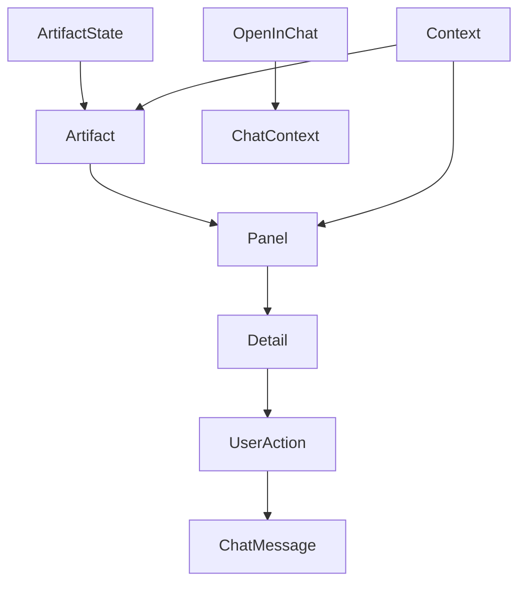

<title>113｜AI Elements Artifact、Panel、OpenInChat 详解</title>

<callout emoji="✅">
**本章目标：**继续按小模块解释职责、输入输出和运行逻辑。
</callout>

| 模块点 | 说明 |
|-|-|
| artifact.tsx | artifact primitive。 |
| panel.tsx | 侧边面板 primitive。 |
| open-in-chat.tsx | 在聊天中打开/引用。 |
| context.tsx | AI element context。 |

