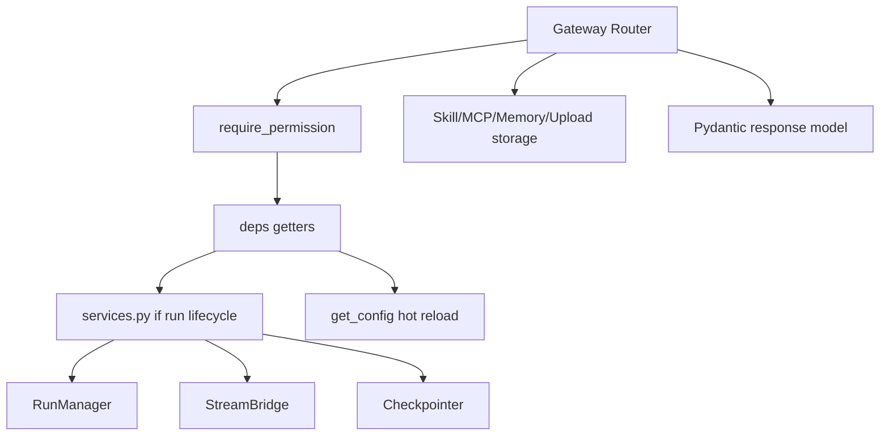
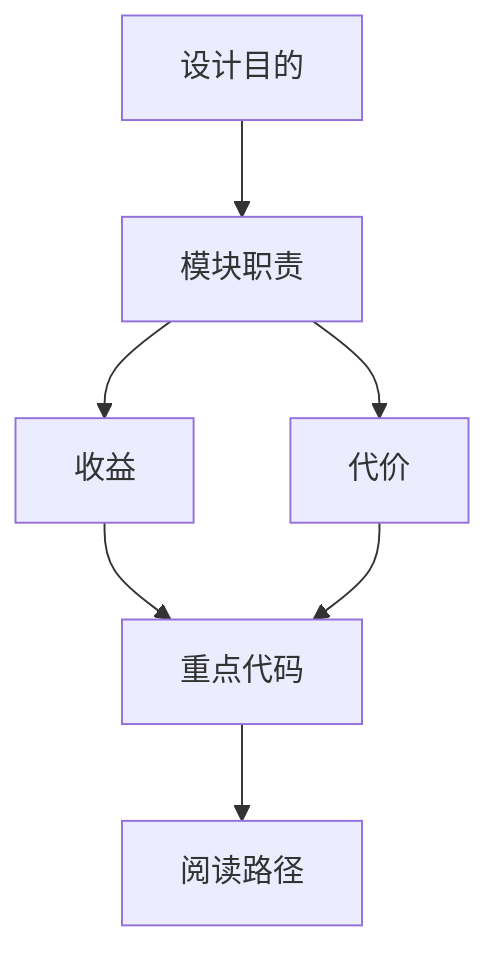

<title>11｜Gateway Routers API 模块逐项详解</title>

<callout emoji="✅">
**本章目标：**把 Gateway 每个 router 的职责、关键接口和前端调用方讲清楚。
</callout>

# 1. Router 总览

| Router | 主要职责 | 典型接口 |
|-|-|-|
| `backend/app/gateway/routers/thread_runs.py` | thread scoped run 创建、stream、wait、cancel、messages、events、token usage | `/api/threads/{id}/runs/stream` |
| `backend/app/gateway/routers/threads.py` | thread 创建、搜索、state、history、删除 | `/api/threads/{id}/state` |
| `backend/app/gateway/routers/runs.py` | 无预存 thread 的 stateless stream/wait | `/api/runs/stream` |
| `backend/app/gateway/routers/models.py` | 暴露已配置模型和 token usage 开关 | `/api/models` |
| `backend/app/gateway/routers/mcp.py` | 读取/更新 MCP server 配置，mask secrets | `/api/mcp/config` |
| `backend/app/gateway/routers/skills.py` | 列出、启停、安装、编辑 custom skills | `/api/skills` |
| `backend/app/gateway/routers/memory.py` | 读取、清空、导入导出 memory 和 facts CRUD | `/api/memory` |
| `backend/app/gateway/routers/uploads.py` | 上传、列出、删除文件，返回 virtual path | `/api/threads/{id}/uploads` |
| `backend/app/gateway/routers/artifacts.py` | 安全地服务 sandbox 产物和 .skill 内部文件 | `/api/threads/{id}/artifacts/{path}` |
| `backend/app/gateway/routers/agents.py` | custom agents CRUD 和用户 profile | `/api/agents` |

# 2. Router 到服务层的关系

# 3. 前端调用映射

| 前端模块 | 调用 API | 后端 router |
|-|-|-|
| `frontend/src/core/models/api.ts` | `GET /api/models` | `backend/app/gateway/routers/models.py` |
| `frontend/src/core/mcp/api.ts` | `GET/PUT /api/mcp/config` | `backend/app/gateway/routers/mcp.py` |
| `frontend/src/core/skills/api.ts` | `GET /api/skills`、install、enable | `backend/app/gateway/routers/skills.py` |
| `frontend/src/core/memory/api.ts` | memory/facts/import/export | `backend/app/gateway/routers/memory.py` |
| `frontend/src/core/uploads/api.ts` | upload/list/delete files | `backend/app/gateway/routers/uploads.py` |
| `frontend/src/core/artifacts/hooks.ts` | artifact content | `backend/app/gateway/routers/artifacts.py` |

# 4. 修改原则

- 新增 API：先写 Pydantic request/response，再接 authz，再写测试。
- 改 run API：同步检查 LangGraph SDK 兼容性，尤其 SSE event 和 stream mode。
- 涉及 secret：返回前必须 mask，例如 MCP env/header/oauth 字段。

---

# 补充：设计取舍、重点代码与阅读路径

<callout emoji="💡">
**设计目的：**Router 拆分是为了把 HTTP API 按资源边界组织。
</callout>

| 维度 | 说明 |
|-|-|
| 收益 | 收益是接口归属清楚；代价是一次功能可能跨 router 与 service。 |
| 代价 | 见收益说明中的代价部分；此章节采用收益与代价合并描述。 |
| 重点代码 | 重点代码：`backend/app/gateway/routers`、`backend/app/gateway/services.py`。 |
| 阅读路径 | 阅读路径：先找 URL 前缀，再找 router，再看 service。 |

