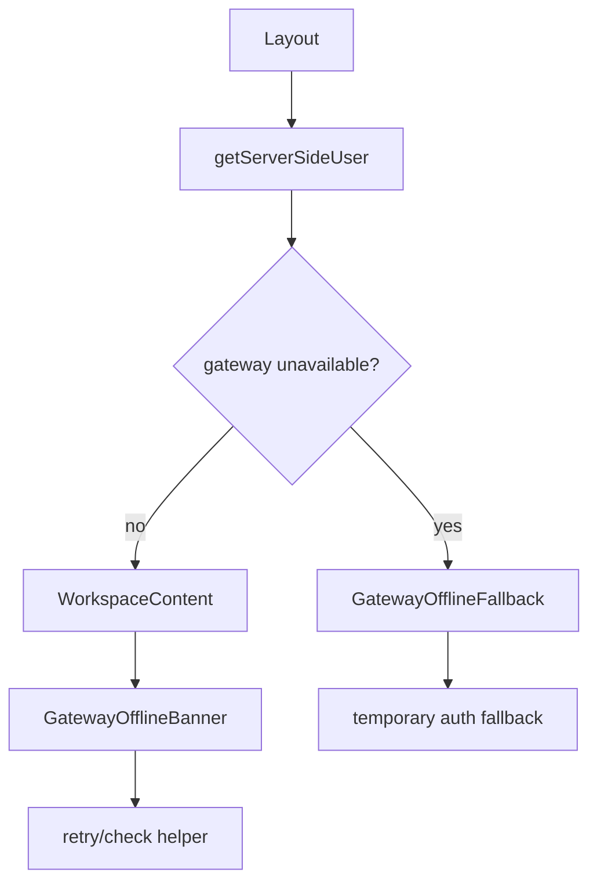

<title>121｜Gateway Offline Banner/Fallback 组件详解</title>

<callout emoji="✅">
**本章目标：**继续按 workspace 业务组件讲解职责、输入输出和运行逻辑。
</callout>

| 组件/文件 | 说明 |
|-|-|
| gateway-offline-banner.tsx | 顶部离线提示。 |
| gateway-offline-fallback.tsx | Gateway 不可用时的整体 fallback。 |
| gateway-offline-banner-helpers.ts | 离线检测辅助。 |
| gateway-offline-fallback in layouts | auth/workspace layout 中兜底渲染。 |

