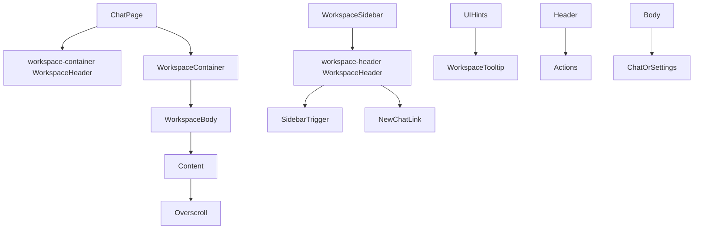
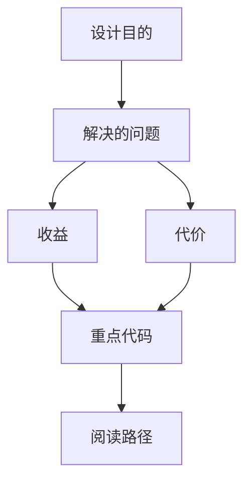

<title>123｜WorkspaceContainer、Header、Overscroll 组件详解</title>

<callout emoji="✅">
**本章目标：**继续按 workspace 业务组件讲解职责、输入输出和运行逻辑。
</callout>

| 组件/文件 | 说明 |
|-|-|
| workspace-container.tsx | 页面主容器，并导出内容区 `WorkspaceHeader`（面包屑 + GitHub 链接）和 `WorkspaceBody`。 |
| workspace-header.tsx | 侧边栏头部：DeerFlow/DF 标识、SidebarTrigger、新建聊天入口。 |
| overscroll.tsx | 滚动边界体验。 |
| tooltip.tsx | workspace 局部 tooltip 封装。 |

---

# 补充：设计取舍、重点代码与阅读路径

<callout emoji="💡">
**设计目的：**前端按 route、core 数据层、业务组件、UI primitive 分层，是为了降低组件耦合。
</callout>

| 维度 | 说明 |
|-|-|
| 收益 | 收益是展示层和数据请求分离，组件更容易复用。 |
| 代价 | 代价是一次用户交互常跨页面、hook、缓存、上下文和组件。 |
| 重点代码 | 重点代码在 `frontend/src/app`、`frontend/src/core`、`frontend/src/components` 对应模块。 |
| 阅读路径 | 阅读路径：先找 route，再找 hook 数据源，最后看组件消费。 |

<callout emoji="⚠️">
注意两个文件都导出名为 `WorkspaceHeader` 的组件；阅读时必须按 import 来源区分主内容 header 与 sidebar header。
</callout>
