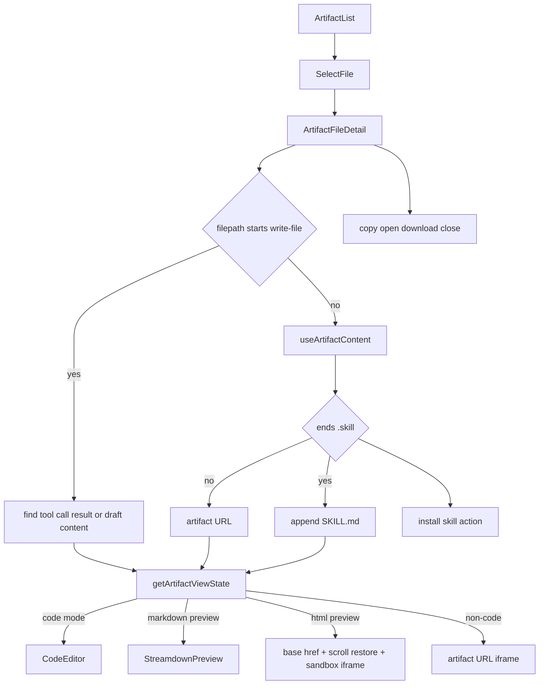
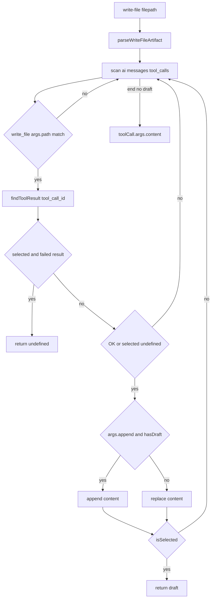

<title>124｜CodeEditor 与 Artifact Detail 交互详解</title>

<callout emoji="✅">
**本章目标：**继续按 workspace 业务组件讲解职责、输入输出和运行逻辑。
</callout>

| 组件/文件 | 说明 |
|-|-|
| code-editor.tsx | 代码查看/编辑展示。 |
| artifact-file-detail.tsx | 根据文件类型选择 code/preview/download。 |
| artifact-file-list.tsx | 选择 artifact。 |
| core/artifacts/preview.ts | 判断预览类型。 |

---

# 补充：设计取舍、重点代码与阅读路径

<callout emoji="💡">
**设计目的：**前端按 route、core 数据层、业务组件、UI primitive 分层，是为了降低组件耦合。
</callout>

| 维度 | 说明 |
|-|-|
| 收益 | 收益是展示层和数据请求分离，组件更容易复用。 |
| 代价 | 代价是一次用户交互常跨页面、hook、缓存、上下文和组件。 |
| 重点代码 | 重点代码在 `frontend/src/app`、`frontend/src/core`、`frontend/src/components` 对应模块。 |
| 阅读路径 | 阅读路径：先找 route，再找 hook 数据源，最后看组件消费。 |

## Artifact detail 运行态补充

- `write-file:` artifact 不走普通 artifact fetch；它从 URL 中解析 `message_id/tool_call_id`，再从当前 thread messages 找对应 tool result 或 draft content。
- `.skill` artifact 被当作 markdown 代码内容读取，实际 fetch 路径会补 `/SKILL.md`，并在非静态站点下显示安装按钮。
- HTML/Markdown 才支持 preview toggle；HTML preview 会注入 `<base>` 和滚动恢复脚本，生成 Blob URL 后放入 sandbox iframe。
- 非代码文件当前直接 iframe 打开 artifact URL；下载按钮通过 `?download=true` 打开新窗口。
