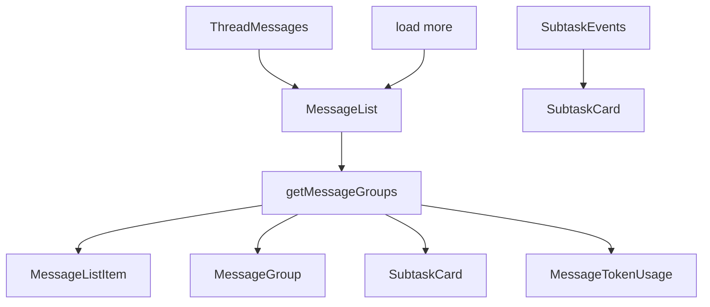

<title>129｜Messages List、Item、Group、Subtask 组件详解</title>

<callout emoji="✅">
**本章目标：**继续拆 frontend 业务模块，说明职责、数据源和运行逻辑。
</callout>

| 模块点 | 说明 |
|-|-|
| message-list.tsx | 消息列表、历史加载、分组渲染。 |
| message-list-item.tsx | 单条消息。 |
| message-group.tsx | processing/reasoning/tool calls。 |
| subtask-card.tsx | task tool 状态。 |
| message-token-usage.tsx | 消息级 token usage。 |

