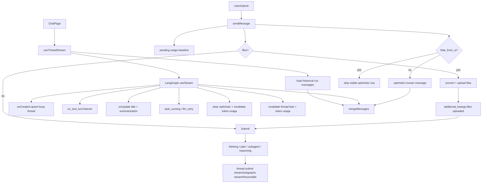

<title>130｜Core Threads Stream、History、Cache 函数组详解</title>

<callout emoji="✅">
**本章目标：**继续拆 frontend 业务模块，说明职责、数据源和运行逻辑。
</callout>

| 模块点 | 说明 |
|-|-|
| useThreadStream | 封装 useStream 和 sendMessage。 |
| mergeMessages | 合并 optimistic/history/stream messages。 |
| useThreadHistory | 读取历史 run messages。 |
| upsertThreadInSearchCache | 更新 thread 搜索缓存。 |
| useInfiniteThreads | 会话列表分页。 |

<callout emoji="💡">
`useThreadStream` 不只是 `useStream` 包装：它还承担 optimistic UI、文件上传、隐藏消息、mode 到运行上下文的映射、subtask/custom event 更新、错误清理和 React Query cache 失效。
</callout>
