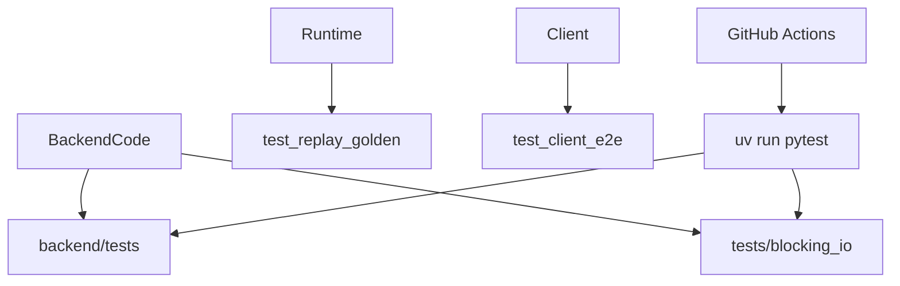
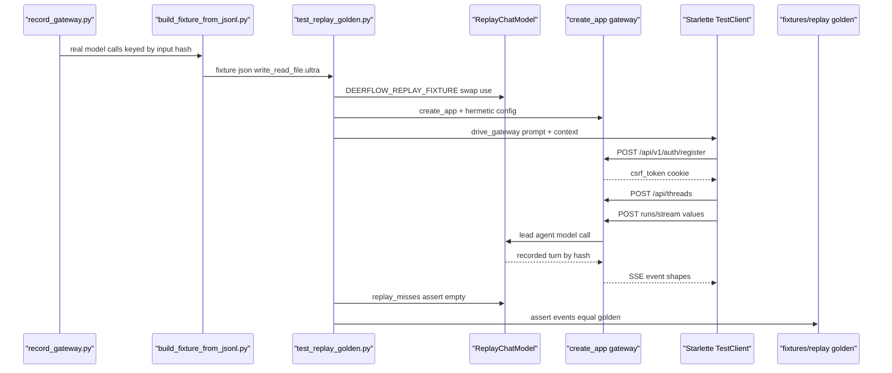

<title>132｜Backend Tests 测试体系详解</title>

<callout emoji="✅">
**本章目标：**补齐测试、脚本、Docker、Skills 分类，解释运行逻辑。
</callout>

| 模块点 | 说明 |
|-|-|
| unit tests | 覆盖 config、runtime、middlewares、routers、tools、memory、MCP、sandbox 等。 |
| blocking_io tests | 检查异步路径不阻塞 event loop。 |
| replay tests | 用 golden fixture 验证 SSE/渲染契约。 |
| e2e/helpers | 真实 gateway/client 辅助测试。 |

---

# 补充：设计取舍、重点代码与阅读路径

<callout emoji="💡">
**设计目的：**前端按 route、core 数据层、业务组件、UI primitive 分层，是为了降低组件耦合。
</callout>

| 维度 | 说明 |
|-|-|
| 收益 | 收益是展示层和数据请求分离，组件更容易复用。 |
| 代价 | 代价是一次用户交互常跨页面、hook、缓存、上下文和组件。 |
| 重点代码 | 重点代码在 `frontend/src/app`、`frontend/src/core`、`frontend/src/components` 对应模块。 |
| 阅读路径 | 阅读路径：先找 route，再找 hook 数据源，最后看组件消费。 |

