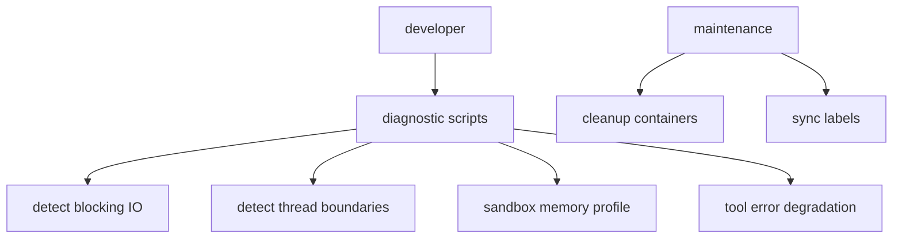
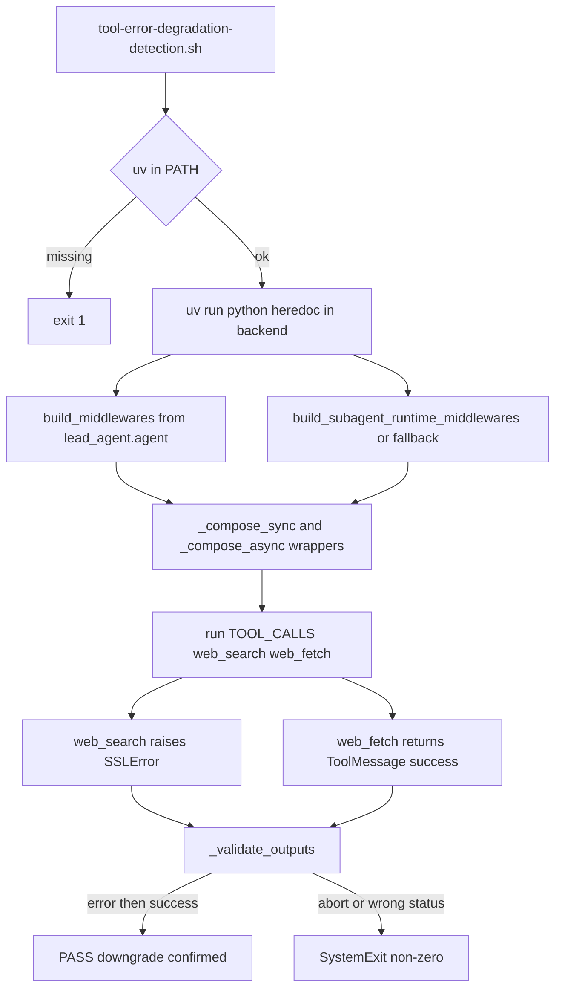

<title>136｜Scripts Diagnostics/Maintenance 脚本详解</title>

<callout emoji="✅">
**本章目标：**补齐测试、脚本、Docker、Skills 分类，解释运行逻辑。
</callout>

| 模块点 | 说明 |
|-|-|
| detect_blocking_io_static.py | 静态扫描阻塞 IO。 |
| detect_thread_boundaries.py | 线程/异步边界清单。 |
| sandbox_memory_profile.py | sandbox 内存画像。 |
| tool-error-degradation-detection.sh | 工具错误降级检测。 |
| cleanup-containers.sh | 清理容器。 |
| sync_labels.py | 同步 issue labels。 |

---

# 补充：设计取舍、重点代码与阅读路径

<callout emoji="💡">
**设计目的：**该模块用于固化工程流程、质量门禁或设计背景，是为了让行为可复现、可审计。
</callout>

| 维度 | 说明 |
|-|-|
| 收益 | 收益是降低回归风险，帮助新人理解历史决策。 |
| 代价 | 代价是容易与代码实现漂移，需要持续维护。 |
| 重点代码 | 重点代码/资料是对应 tests、scripts、workflow、docs 文件及其调用的源码入口。 |
| 阅读路径 | 阅读路径：按输入、执行步骤、输出证据三段看。 |

