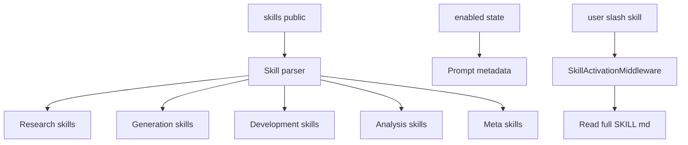
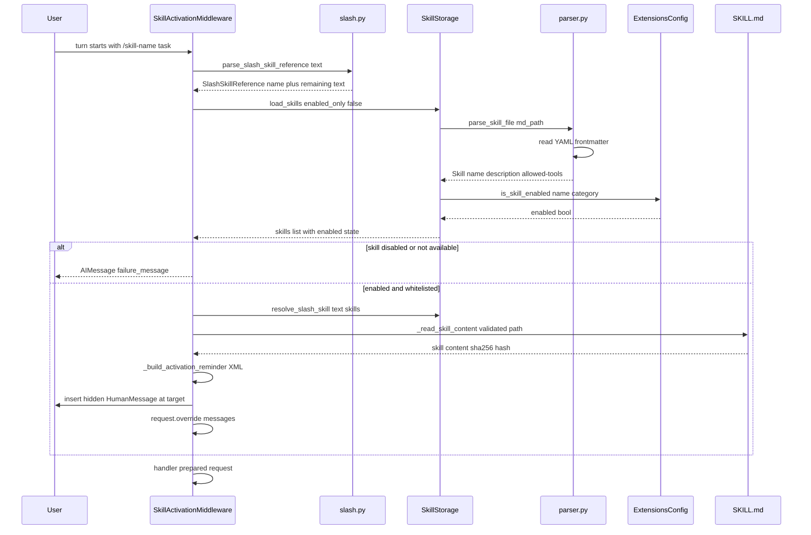

<title>138｜Public Skills 分类与运行逻辑详解</title>

<callout emoji="✅">
**本章目标：**补齐测试、脚本、Docker、Skills 分类，解释运行逻辑。
</callout>

| 模块点 | 说明 |
|-|-|
| Research | deep-research、github-deep-research、academic-paper-review、systematic-literature-review。 |
| Generation | image/music/video/podcast/ppt/newsletter。 |
| Development | frontend-design、code-documentation、vercel-deploy、claude-to-deerflow。 |
| Analysis | data-analysis、consulting-analysis、chart-visualization。 |
| Meta | skill-creator、find-skills、bootstrap、surprise-me。 |

## 补充：Public Skills 分类简化运行图

---

# 补充：设计取舍、重点代码与阅读路径

<callout emoji="💡">
**设计目的：**该文档说明一个 public skill 或 skill 分类的目标、触发条件、执行链路和维护边界，方便新同学理解 DeerFlow 的可扩展能力。
</callout>

| 维度 | 说明 |
|-|-|
| 收益 | skill 能力被文档化后，使用者能快速判断何时触发、读哪些文件、如何验证输出。 |
| 代价 | skill 文档容易和实际 `SKILL.md` 漂移，需要定期回到源码和示例验证。 |
| 重点代码 | 对应 `skills/public/.../SKILL.md`、相关 `references/`、`templates/`、`scripts/`。 |
| 阅读路径 | 先读 skill frontmatter 和触发场景，再读正文 workflow，最后检查 references/templates/scripts 是否支撑描述。 |

