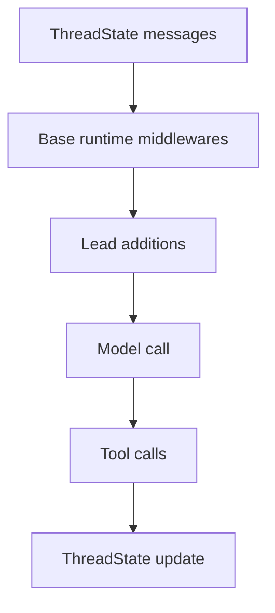
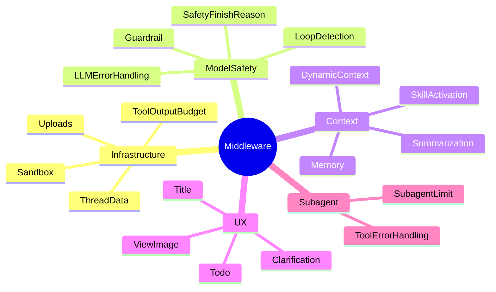
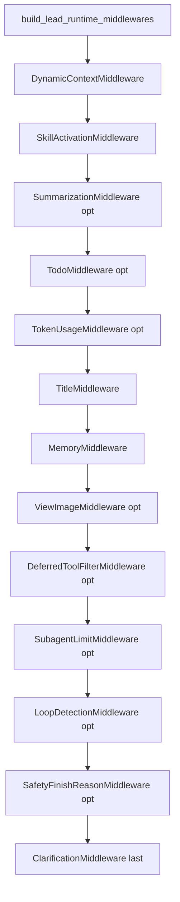

<title>13｜Backend Middleware 模块逐项详解</title>

<callout emoji="✅">
**本章目标：**把每个 backend middleware 单独讲清楚：它解决什么问题、位于哪个阶段、读写哪些 state。
</callout>

## 本轮源码校准补充：Middleware 分层总览

| 层级 | 主要 middleware | 学习重点 |
|-|-|-|
| 文件/线程环境 | ThreadData、Uploads、Sandbox | 线程目录、上传文件注入、sandbox 生命周期。 |
| 工具调用安全 | ToolOutputBudget、DanglingToolCall、LLMErrorHandling、SandboxAudit、ToolErrorHandling | 输出预算、异常工具调用修复、错误归一化、审计。 |
| 运行时上下文 | DynamicContext、SkillActivation、Summarization、Todo、TokenUsage | 动态 hidden context、skill 激活、压缩上下文、计划模式、token 统计。 |
| 副作用/终止 | Title、Memory、DeferredToolFilter、SubagentLimit、LoopDetection、SafetyFinishReason、Clarification | 标题、长期记忆、延迟工具、子任务限制、循环/安全、澄清中断。 |

# 1. Middleware 分类

# 2. 逐项说明

| Middleware | 读写 state | 运行逻辑 |
|-|-|-|
| ToolOutputBudget | messages / tool output | 工具输出超过阈值时外置到 outputs，并返回摘要预览。 |
| ThreadData | thread_data | 根据 user/thread 创建 workspace/uploads/outputs 目录。 |
| Uploads | uploaded_files / messages | 扫描 uploads，生成文件摘要并注入上下文。 |
| Sandbox | sandbox | 懒加载 sandbox，工具调用后把 sandbox_id 持久化。 |
| DynamicContext | messages | 找到最后一条用户消息，注入日期和 memory reminder。 |
| SkillActivation | messages | 识别 /skill-name，读取完整 SKILL.md 注入隐藏上下文。 |
| Summarization | messages | 接近上下文限制时摘要，并保护最近 skill 内容。 |
| Todo | todos / messages | plan mode 下维护 todo，并插入完成提醒。 |
| Title | title | 首轮后用模型生成简短标题。 |
| Memory | messages | after_agent 入队异步抽取长期记忆。 |
| ViewImage | viewed_images | 视觉模型下把 view_image 结果转为图像上下文。 |
| SubagentLimit | messages | 限制同轮 task tool 并发数量。 |
| LoopDetection | messages | 检测重复 tool call 循环并注入 warning。 |
| Clarification | interrupt | 将 ask_clarification 转为用户澄清中断。 |

# 3. 调试路径

- 上下文异常：查 DynamicContext、SkillActivation、Summarization。
- 文件/工具异常：查 ThreadData、Uploads、Sandbox、ToolOutputBudget。
- UI 状态异常：查 Todo、Title、Memory、ViewImage 对 state 的更新。

---

# 补充：设计取舍、重点代码与阅读路径

<callout emoji="💡">
**设计目的：**Middleware 以链式方式承载横切能力，是为了不把文件、记忆、安全、标题等逻辑塞进 agent 主体。
</callout>

| 维度 | 说明 |
|-|-|
| 收益 | 收益是可插拔；代价是执行顺序和 before/after 方向需要理解。 |
| 代价 | 见收益说明中的代价部分；此章节采用收益与代价合并描述。 |
| 重点代码 | 重点代码：`backend/packages/harness/deerflow/agents/lead_agent/agent.py` 的 build_middlewares 和 `backend/packages/harness/deerflow/agents/middlewares`。 |
| 阅读路径 | 阅读路径：先看组装顺序，再看 hook 类型。 |

