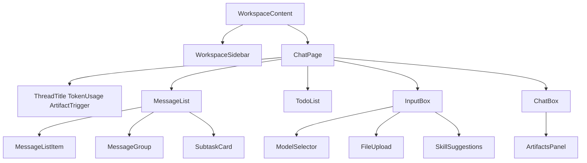
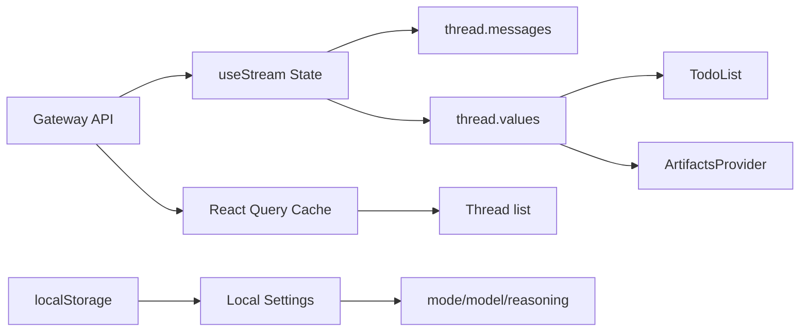
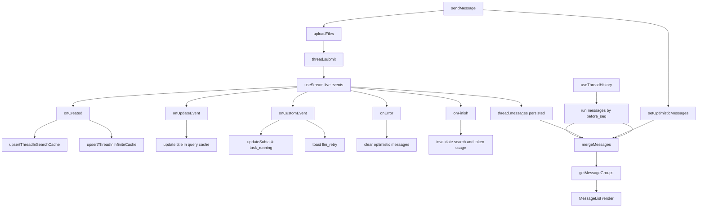

<title>14｜Frontend Core Hooks 与 UI 模块逐项详解</title>

<callout emoji="✅">
**本章目标：**把前端 core 层和 workspace UI 层按模块拆开讲，便于定位问题和新增功能。
</callout>

# 1. Core 模块地图

| Core 模块 | 职责 | 关键函数 |
|-|-|-|
| `frontend/src/core/threads/hooks.ts` | LangGraph stream、thread list、history、runs、token usage、delete/rename | `useThreadStream`、`useInfiniteThreads` |
| `frontend/src/core/messages/utils.ts` | 消息分组、reasoning 提取、隐藏控制消息、附件解析 | `getMessageGroups`、`extractContentFromMessage` |
| `frontend/src/core/artifacts/*` | artifact URL、内容加载、预览类型 | `useArtifactContent` |
| `frontend/src/core/uploads/*` | 上传/列出/删除文件 | `uploadFiles` |
| `frontend/src/core/settings/*` | localStorage 与 thread model override | `useThreadSettings` |
| `frontend/src/core/{models,mcp,skills,memory}` | Settings/API 数据层 | load/update hooks |

# 2. UI 模块地图

# 3. 前端状态来源

# 4. 修改建议

- 新增后端状态字段：更新 `AgentThreadState` 类型、MessageList 或对应 UI 消费方。
- 新增 Settings 页：新增 core API/hook，再接入 SettingsDialog section。
- 新增消息类型：先改 `getMessageGroups`，再新增渲染分支。

---

# 补充：设计取舍、重点代码与阅读路径

<callout emoji="💡">
**设计目的：**前端 core hooks 把 UI 与 API 解耦，是为了组件只关心状态而不是请求细节。
</callout>

| 维度 | 说明 |
|-|-|
| 收益 | 收益是复用强；代价是缓存更新和乐观状态较复杂。 |
| 代价 | 见收益说明中的代价部分；此章节采用收益与代价合并描述。 |
| 重点代码 | 重点代码：`frontend/src/core/threads/hooks.ts`、`frontend/src/core/messages/utils.ts`。 |
| 阅读路径 | 阅读路径：hook 是数据层，component 是展示层。 |

