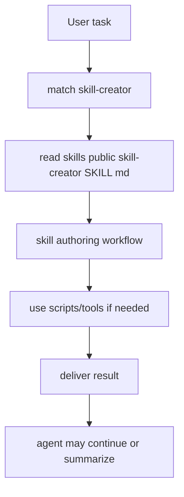
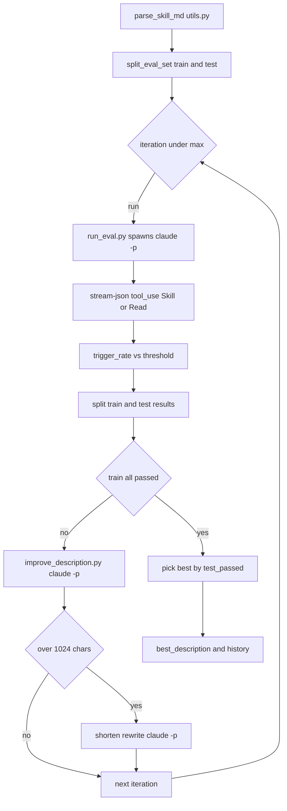

<title>154｜skill-creator Public Skill 详解</title>

<callout emoji="✅">
**Skill 目标：**创建新 skill 的结构化流程。
</callout>

| 字段 | 说明 |
|-|-|
| Skill 名称 | `skill-creator` |
| 路径 | `skills/public/skill-creator/SKILL.md` |
| 类型 | skill authoring |
| 触发方式 | 任务匹配或显式 `/skill-creator` |

---

# 补充：设计取舍、重点代码与阅读路径

<callout emoji="💡">
**设计目的：**该文档说明一个 public skill 或 skill 分类的目标、触发条件、执行链路和维护边界，方便新同学理解 DeerFlow 的可扩展能力。
</callout>

| 维度 | 说明 |
|-|-|
| 收益 | skill 能力被文档化后，使用者能快速判断何时触发、读哪些文件、如何验证输出。 |
| 代价 | skill 文档容易和实际 `SKILL.md` 漂移，需要定期回到源码和示例验证。 |
| 重点代码 | 对应 `skills/public/.../SKILL.md`、相关 `references/`、`templates/`、`scripts/`。 |
| 阅读路径 | 先读 skill frontmatter 和触发场景，再读正文 workflow，最后检查 references/templates/scripts 是否支撑描述。 |

