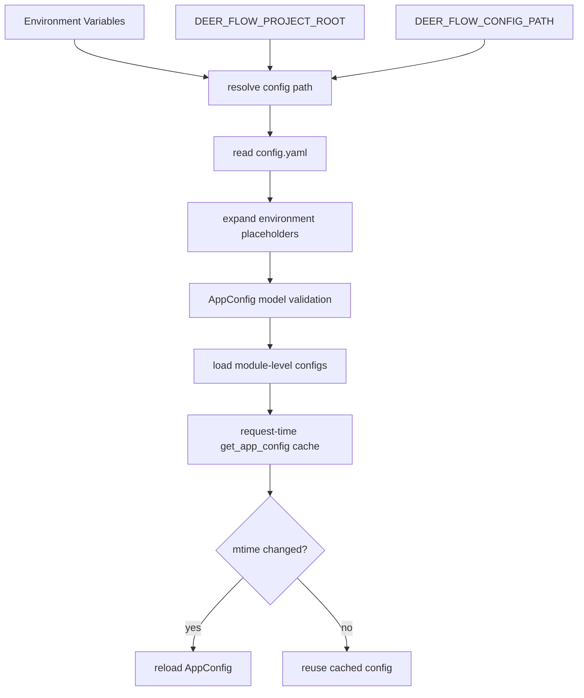
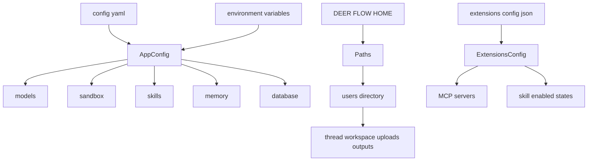
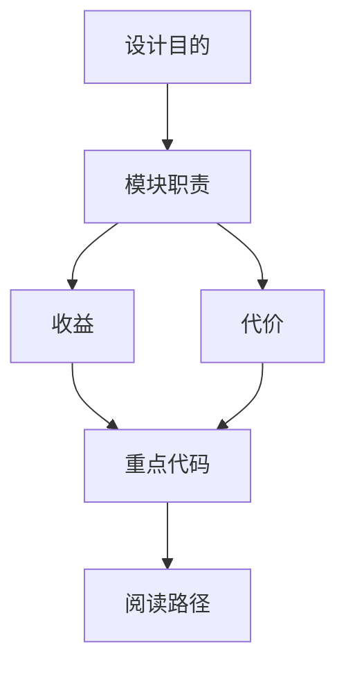

<title>15｜Config、Paths 与 Hot Reload 边界详解</title>

<callout emoji="✅">
**本章目标：**把 config.yaml、extensions_config.json、Paths、startup-only 边界和热加载关系讲清楚。
</callout>

# 1. 配置对象地图

| 配置类 | 职责 | 关键文件 |
|-|-|-|
| `AppConfig` | 聚合 models、tools、sandbox、skills、memory、database、subagents 等主配置 | `config/app_config.py` |
| `ExtensionsConfig` | MCP servers 和 skill enabled 状态 | `config/extensions_config.py` |
| `Paths` | 运行期目录、thread/user 数据目录、uploads/outputs 路径 | `config/paths.py` |
| `ModelConfig` | 单个模型 provider 配置 | `config/model_config.py` |
| `SandboxConfig` | sandbox provider、mounts、host bash 开关 | `config/sandbox_config.py` |
| `MemoryConfig` | memory 开关、路径、token budget、debounce | `config/memory_config.py` |

# 2. 配置加载流程



# 3. Paths 目录生成

# 4. 热加载边界

请求期配置通过 `get_app_config()` 可随 mtime 热加载；但 stream bridge、checkpointer、store、event store、sandbox provider、IM channels 等启动期单例需要重启才能完全生效。

```text
backend/packages/harness/deerflow/config/app_config.py
backend/packages/harness/deerflow/config/extensions_config.py
backend/packages/harness/deerflow/config/paths.py
backend/packages/harness/deerflow/config/reload_boundary.py
```

## 补充：Config 与 Paths 简化运行图



---

# 补充：设计取舍、重点代码与阅读路径

<callout emoji="💡">
**设计目的：**Paths 和 reload boundary 是为了区分运行期可热加载配置与启动期资源。
</callout>

| 维度 | 说明 |
|-|-|
| 收益 | 收益是部分配置可热更新；代价是用户可能误以为所有配置都即时生效。 |
| 代价 | 见收益说明中的代价部分；此章节采用收益与代价合并描述。 |
| 重点代码 | 重点代码：`backend/packages/harness/deerflow/config/app_config.py`、`backend/packages/harness/deerflow/config/paths.py`、`backend/packages/harness/deerflow/config/reload_boundary.py`。 |
| 阅读路径 | 阅读路径：请求期读 AppConfig，启动期资源要重启。 |

