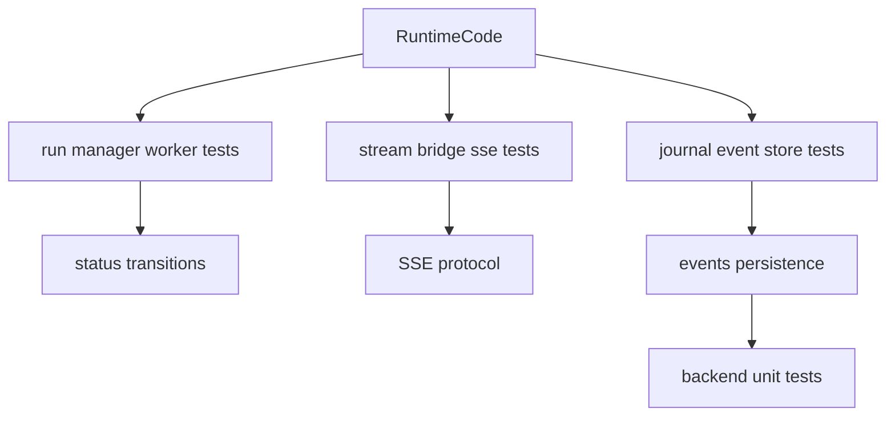
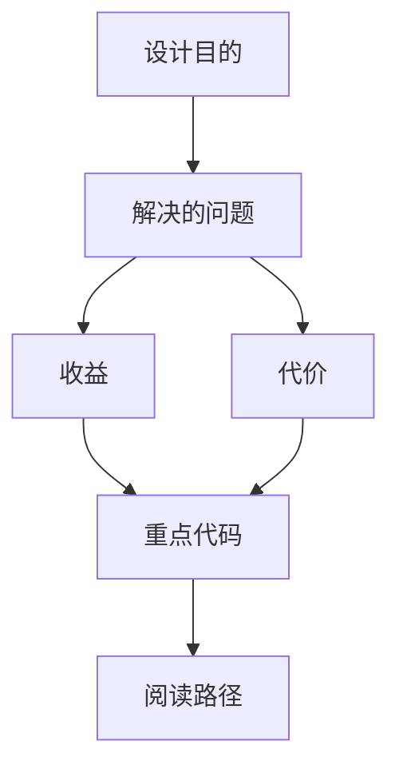
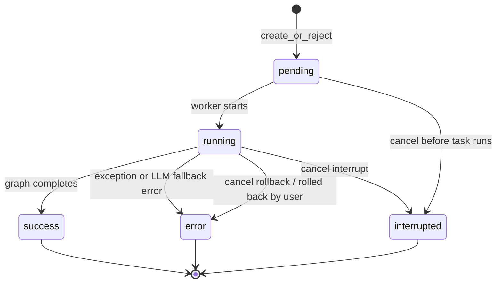

<title>168｜Backend Runtime/Run/Stream Tests 分类详解</title>

<callout emoji="✅">
**本章目标：**继续拆测试/CI/脚本模块，说明覆盖范围、运行入口和逻辑。
</callout>

| 模块点 | 说明 |
|-|-|
| run_manager/run_repository | run 状态、持久化、恢复。 |
| run_worker_rollback | rollback checkpoint。 |
| stream_bridge/sse_format | SSE 格式和 bridge。 |
| run_journal/run_event_store | 事件记录和分页。 |
| thread_token_usage | token usage 聚合。 |

---

# 补充：设计取舍、重点代码与阅读路径

<callout emoji="💡">
**设计目的：**这组测试保护 Gateway embedded runtime 的 run 生命周期：创建 pending run、worker 置为 running、通过 StreamBridge 发布 SSE、结束时落到 success/error/interrupted，并验证 cancel、rollback、事件存储与 token usage 不互相破坏。
</callout>

| 维度 | 说明 |
|-|-|
| 收益 | run 状态、SSE wire 协议、journal/event store 和恢复逻辑可以分别回归。 |
| 代价 | 一次运行横跨 `RunManager`、`run_agent` worker、`StreamBridge`、RunStore/EventStore 和 Gateway SSE consumer。 |
| 重点代码 | `backend/packages/harness/deerflow/runtime/runs/schemas.py`、`runtime/runs/manager.py`、`runtime/runs/worker.py`、`runtime/stream_bridge/`、`runtime/events/store/`、`backend/app/gateway/services.py`。 |
| 阅读路径 | 先看 `RunStatus`，再看 `create_or_reject/cancel`，然后看 worker 如何 publish metadata/messages/error/end，最后看 StreamBridge 如何支持 `Last-Event-ID` 重连与保留窗口。 |

