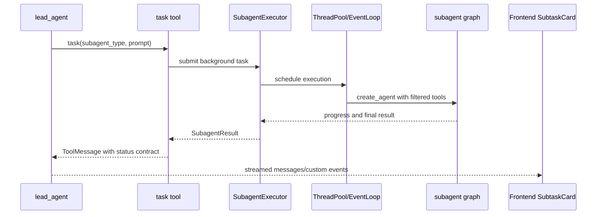
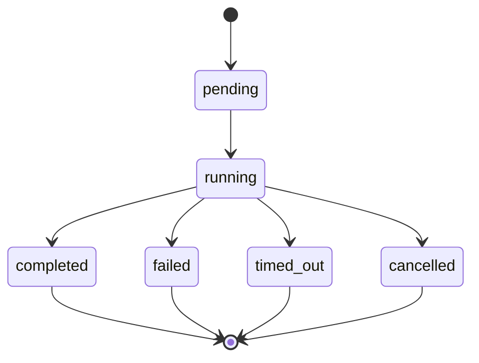
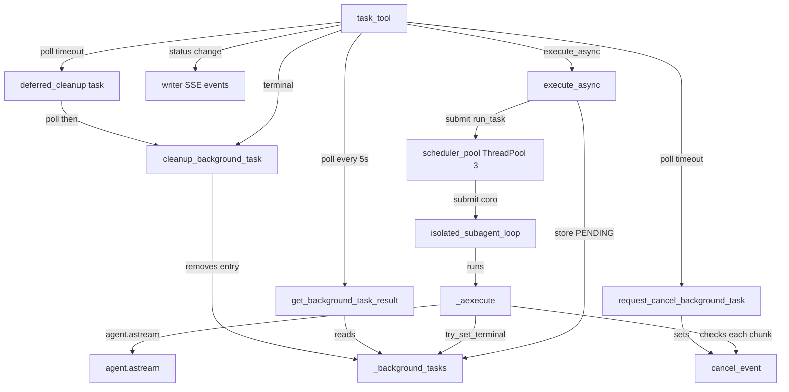

<title>16｜Subagents、Task Tool 与并发执行详解</title>

<callout emoji="✅">
**本章目标：**讲清 ultra mode 下 task tool 如何创建子代理、如何并发、如何回传状态。
</callout>

# 1. Subagent 组件

| 模块 | 职责 |
|-|-|
| `subagents/registry.py` | 注册 built-in 和 custom subagent 配置。 |
| `subagents/executor.py` | 后台执行、线程池、状态存储、超时取消、token 采集。 |
| `tools/builtins/task_tool.py` | 暴露给 lead_agent 的 task 工具。 |
| `subagents/status_contract.py` | 把子代理结果转成 UI 可识别 additional_kwargs。 |
| `SubagentLimitMiddleware` | 限制同轮并发 task 调用数量。 |

# 2. task tool 调用流程

# 3. 状态机

# 4. 调试建议

- 子任务不出现：检查 `subagent_enabled` 是否为 true，通常 ultra mode 才开启。
- 并发被截断：检查 `max_concurrent_subagents` 和 SubagentLimitMiddleware。
- 结果 UI 异常：检查 status_contract 和前端 `parseSubtaskResult`。

---

# 补充：设计取舍、重点代码与阅读路径

<callout emoji="💡">
**设计目的：**Subagent 通过 task tool 异步执行，是为了让复杂任务并行分解。
</callout>

| 维度 | 说明 |
|-|-|
| 收益 | 收益是吞吐和专业化更好；代价是状态、超时、token 归因复杂。 |
| 代价 | 见收益说明中的代价部分；此章节采用收益与代价合并描述。 |
| 重点代码 | 重点代码：`backend/packages/harness/deerflow/tools/builtins/task_tool.py`、`backend/packages/harness/deerflow/subagents/executor.py`。 |
| 阅读路径 | 阅读路径：task tool 是入口，executor 是调度器。 |

