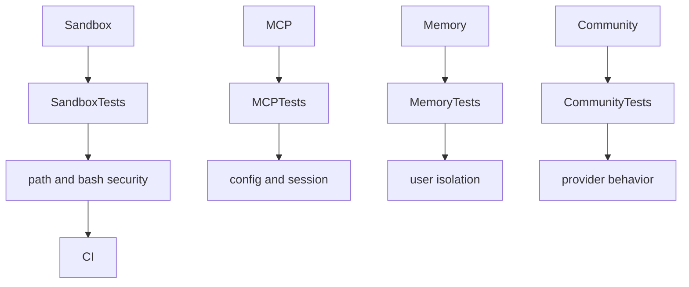
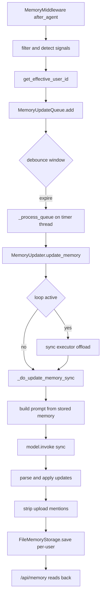

<title>170｜Backend Sandbox/MCP/Memory Tests 分类详解</title>

<callout emoji="✅">
**本章目标：**继续拆测试/CI/脚本模块，说明覆盖范围、运行入口和逻辑。
</callout>

| 模块点 | 说明 |
|-|-|
| sandbox tests | local/aio sandbox、路径、安全、搜索。 |
| MCP tests | client config、OAuth、session pool、secrets。 |
| memory tests | storage、queue、router、updater、user isolation。 |
| community tools tests | ddg/exa/firecrawl/infoquest/jina/serper。 |

---

# 补充：设计取舍、重点代码与阅读路径

<callout emoji="💡">
**设计目的：**这组测试保护 agent 执行环境的边界能力：sandbox 路径与 bash 安全、MCP 配置/OAuth/session/secrets、memory 的 storage/queue/router/updater 与 user isolation，以及 community provider 行为。
</callout>

| 维度 | 说明 |
|-|-|
| 收益 | 外部工具、长期记忆、沙箱文件系统和第三方 provider 的高风险边界都有可回归证据。 |
| 代价 | 问题常跨配置、运行时 ContextVar、文件路径、后台队列和 provider wrapper。 |
| 重点代码 | `backend/packages/harness/deerflow/sandbox/`、`backend/packages/harness/deerflow/agents/memory/`、`backend/packages/harness/deerflow/agents/middlewares/memory_middleware.py`、`backend/app/gateway/routers/memory.py`、`backend/packages/harness/deerflow/mcp/` 与 community provider 模块。 |
| 阅读路径 | 先按测试名定位 sandbox/MCP/memory/provider 子系统，再确认配置入口、用户上下文、持久化路径和失败降级分支。 |

