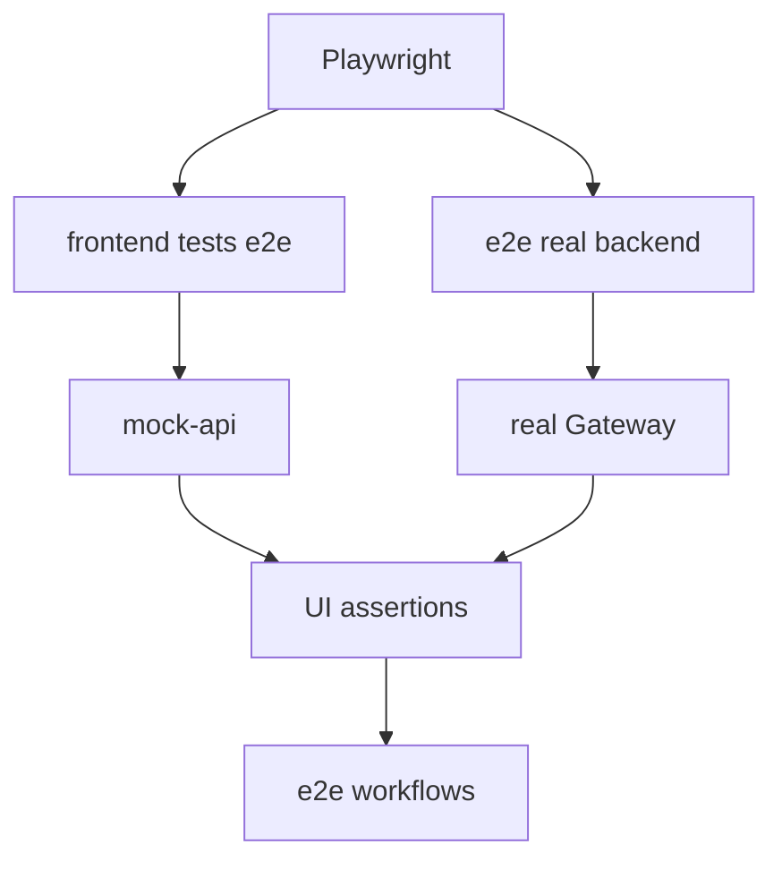
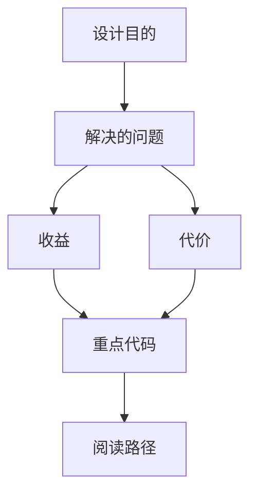

<title>171｜Frontend E2E Specs 分类详解</title>

<callout emoji="✅">
**本章目标：**继续拆测试/CI/脚本模块，说明覆盖范围、运行入口和逻辑。
</callout>

| 模块点 | 说明 |
|-|-|
| chat.spec / agent-chat | 聊天主流程。 |
| sidebar / thread-list | 侧边栏和会话列表。 |
| artifact-preview | artifact 面板。 |
| thread-history / mermaid | 历史消息和 mermaid 渲染。 |
| real-backend specs | 真实后端渲染和多 run 顺序。 |

---

# 补充：设计取舍、重点代码与阅读路径

<callout emoji="💡">
**设计目的：**该模块用于固化工程流程、质量门禁或设计背景，是为了让行为可复现、可审计。
</callout>

| 维度 | 说明 |
|-|-|
| 收益 | 收益是降低回归风险，帮助新人理解历史决策。 |
| 代价 | 代价是容易与代码实现漂移，需要持续维护。 |
| 重点代码 | 重点代码/资料是对应 tests、scripts、workflow、docs 文件及其调用的源码入口。 |
| 阅读路径 | 阅读路径：按输入、执行步骤、输出证据三段看。 |

