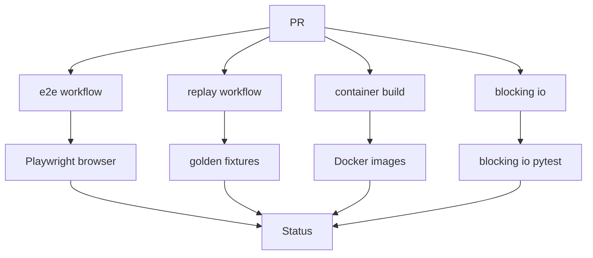

<title>175｜E2E、Replay、Container Workflows 详解</title>

<callout emoji="✅">
**本章目标：**继续拆 CI、脚本、E2E 具体模块，说明触发、执行与产出。
</callout>

| 模块点 | 说明 |
|-|-|
| e2e-tests.yml | 运行 Playwright E2E。 |
| replay-e2e.yml | 运行 replay golden 契约。 |
| container.yaml | 构建容器镜像。 |
| backend-blocking-io-tests.yml | 阻塞 IO gate。 |

