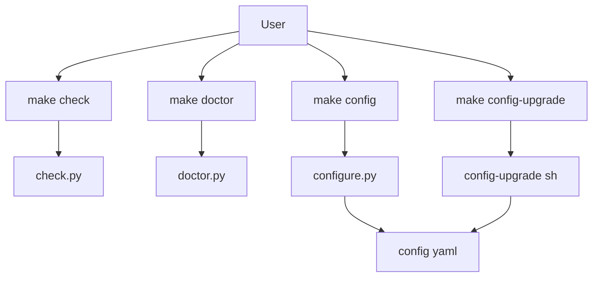
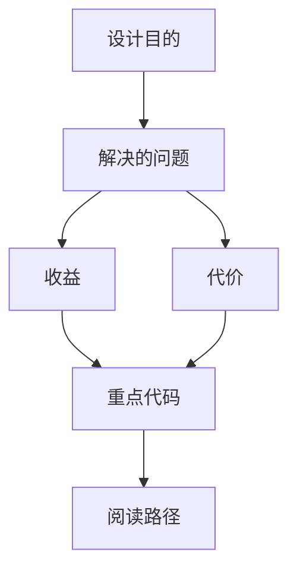

<title>176｜check.py、doctor.py、configure.py、config-upgrade 详解</title>

<callout emoji="✅">
**本章目标：**继续拆 CI、脚本、E2E 具体模块，说明触发、执行与产出。
</callout>

| 模块点 | 说明 |
|-|-|
| check.py | 检查 Python/Node/pnpm/uv/nginx 等依赖。 |
| doctor.py | 诊断配置、模型、环境问题。 |
| configure.py | 生成 config.yaml。 |
| config-upgrade.sh | 合并新配置字段。 |

---

# 补充：设计取舍、重点代码与阅读路径

<callout emoji="💡">
**设计目的：**该模块用于固化工程流程、质量门禁或设计背景，是为了让行为可复现、可审计。
</callout>

| 维度 | 说明 |
|-|-|
| 收益 | 收益是降低回归风险，帮助新人理解历史决策。 |
| 代价 | 代价是容易与代码实现漂移，需要持续维护。 |
| 重点代码 | 重点代码/资料是对应 tests、scripts、workflow、docs 文件及其调用的源码入口。 |
| 阅读路径 | 阅读路径：按输入、执行步骤、输出证据三段看。 |

