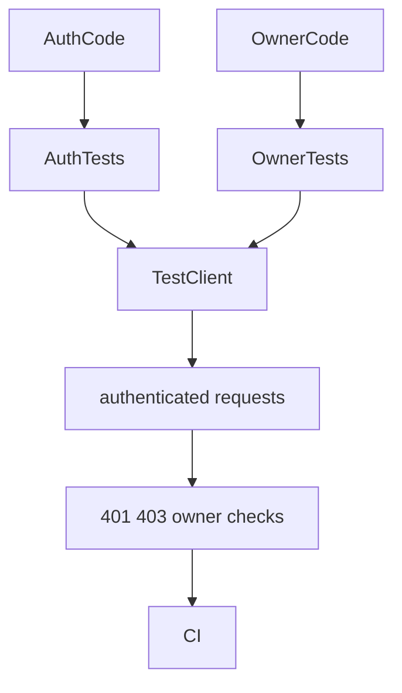
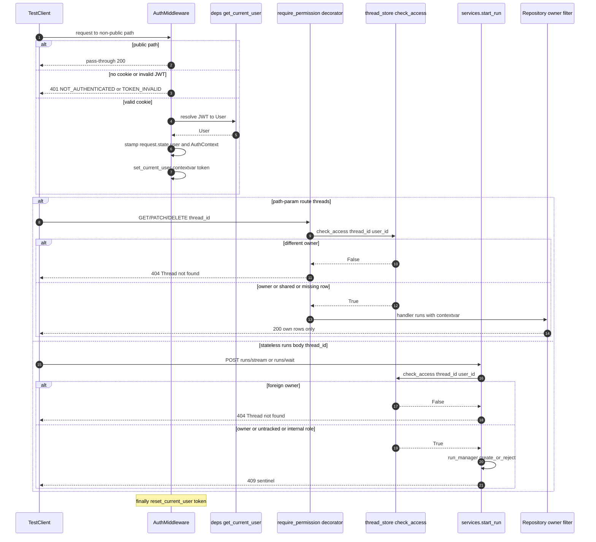

<title>181｜Auth / Owner Isolation Tests 详解</title>

<callout emoji="✅">
**本章目标：**继续拆测试/workflow/script 单文件族，说明覆盖目标和运行逻辑。
</callout>

| 模块点 | 说明 |
|-|-|
| test_auth\*.py | 认证配置、错误、middleware、类型系统。 |
| test_owner_isolation.py | owner 隔离。 |
| test_stateless_runs_owner_isolation.py | stateless runs owner 隔离。 |
| \_router_auth_helpers.py | router auth 测试辅助。 |

---

# 补充：设计取舍、重点代码与阅读路径

<callout emoji="💡">
**设计目的：**这组测试验证认证身份如何进入 Gateway 请求，并在 threads/runs/uploads/artifacts/memory/feedback 等资源访问时保持 owner isolation。
</callout>

| 维度 | 说明 |
|-|-|
| 收益 | 401/403/404、CSRF、admin 初始化、无 auth 兼容和跨用户隔离都有明确回归点。 |
| 代价 | 一次鉴权问题可能跨 middleware、permission decorator、repository owner filter、ContextVar 和测试 helper。 |
| 重点代码 | `backend/app/gateway/auth_middleware.py`、`backend/app/gateway/authz.py`、`backend/app/gateway/auth/`、`backend/tests/_router_auth_helpers.py`、`backend/tests/test_owner_isolation.py`、`backend/tests/test_stateless_runs_owner_isolation.py`。 |
| 阅读路径 | 先看请求如何得到 current user，再看 owner_check 如何查资源归属，最后用测试确认未授权、跨用户和 auth-disabled 分支。 |

