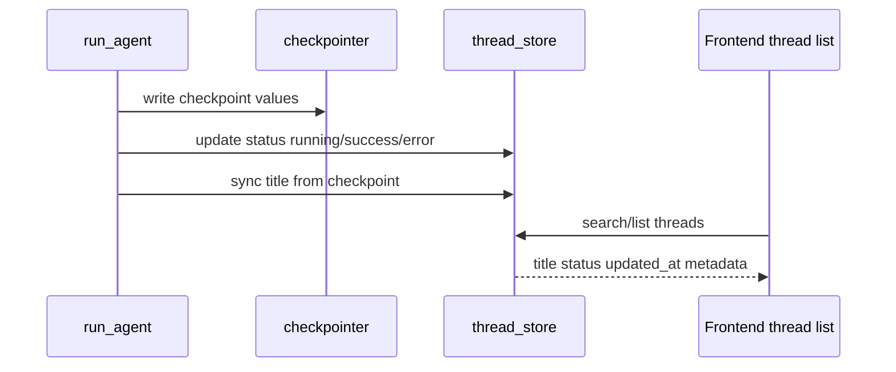
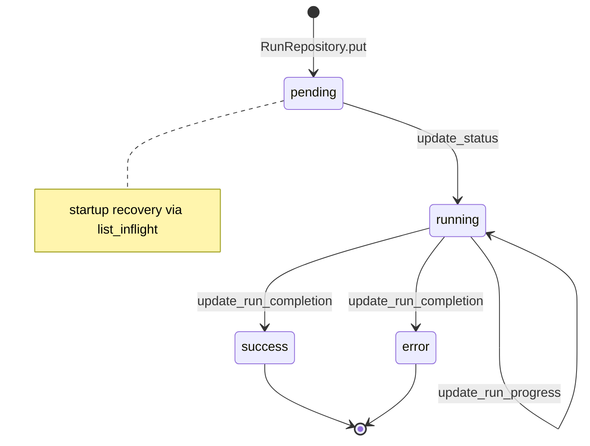

<title>18｜Persistence、Database、ThreadMeta 与 Feedback 详解</title>

<callout emoji="✅">
**本章目标：**讲清 SQL/内存持久化层如何保存 run、thread metadata、feedback、user。
</callout>

# 1. Persistence 层结构

```mermaid
flowchart TD
  Config[DatabaseConfig] --> Engine[init_engine_from_config]
  Engine --> Session[async_sessionmaker]
  Session --> RunRepo[RunRepository]
  Session --> FeedbackRepo[FeedbackRepository]
  Session --> ThreadRepo[ThreadMetaRepository]
  Session --> UserRow[UserRow]
  RunRepo --> RunRow[run table]
  FeedbackRepo --> FeedbackRow[feedback table]
  ThreadRepo --> ThreadMetaRow[thread_meta table]
  Events[RunEventStore] --> RunEventRow[run_events table]
```

# 2. Store 选择

如果有数据库 session factory，就使用 SQL repository；否则部分能力回落到内存实现。SQLite 启动时还会 reconcile orphan inflight runs。

| 模块 | 职责 | 关键文件 |
|-|-|-|
| Engine | 创建/关闭 SQLAlchemy async engine | `persistence/engine.py` |
| RunRepository | 持久化 RunRecord | `persistence/run/sql.py` |
| ThreadMetaRepository | thread title/status/metadata 查询 | `persistence/thread_meta/sql.py` |
| FeedbackRepository | run feedback CRUD 和统计 | `persistence/feedback/sql.py` |
| JsonMatch | 跨 SQLite/Postgres 的 JSON metadata 查询 | `persistence/json_compat.py` |

# 3. Thread metadata 更新链路

# 4. 迁移与排障

- 数据库初始化失败：查 `init_engine_from_config` 和连接字符串。
- 会话列表标题不更新：查 run 收尾是否同步 checkpoint title 到 thread meta。
- feedback 不显示：查 feedback router 与 FeedbackRepository。

---

# 补充：设计取舍、重点代码与阅读路径

<callout emoji="💡">
**设计目的：**持久化拆成 engine、repository、model，是为了兼容内存/SQLite/Postgres 等后端。
</callout>

| 维度 | 说明 |
|-|-|
| 收益 | 收益是运行状态可恢复；代价是 schema、JSON 查询和用户隔离要严格。 |
| 代价 | 见收益说明中的代价部分；此章节采用收益与代价合并描述。 |
| 重点代码 | 重点代码：`backend/packages/harness/deerflow/persistence`。 |
| 阅读路径 | 阅读路径：model 定义表，repository 定义行为，engine 管连接。 |

