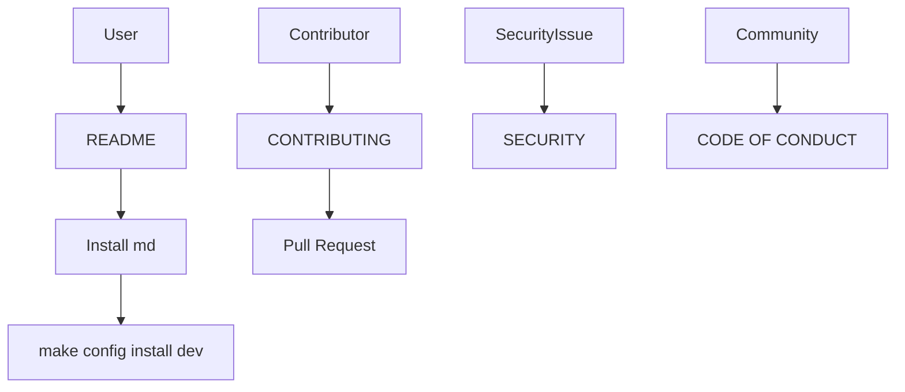
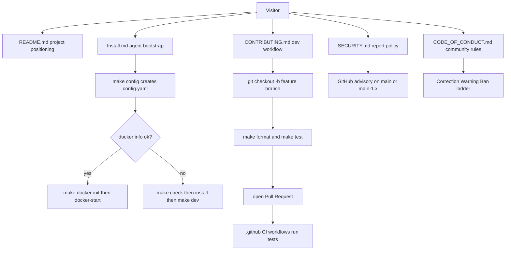

<title>201｜Root Docs、Install、Contributing、Security 详解</title>

<callout emoji="✅">
**本章目标：**继续补齐剩余测试与文档规格模块。
</callout>

| 模块点 | 说明 |
|-|-|
| README_zh/README | 项目定位与快速开始。 |
| Install.md | 给 coding agent 的安装初始化说明。 |
| CONTRIBUTING.md | 贡献流程。 |
| SECURITY.md | 安全说明。 |
| CODE_OF_CONDUCT.md | 社区规范。 |

---

# 补充：设计取舍、重点代码与阅读路径

<callout emoji="💡">
**设计目的：**这个模块采用 middleware 形态，是为了把横切逻辑从核心 agent 流程里剥离，按 before/after/wrap 阶段插入。
</callout>

| 维度 | 说明 |
|-|-|
| 收益 | 收益是职责独立、便于单测和按配置启停。 |
| 代价 | 代价是顺序和状态合并不直观，多 middleware 同时改 messages/state 时需要按链路排查。 |
| 重点代码 | 重点代码在 `backend/packages/harness/deerflow/agents/middlewares/` 对应文件，优先看 hook 方法。 |
| 阅读路径 | 阅读路径：先定位 hook 阶段，再看它读写哪个 state 字段。 |

