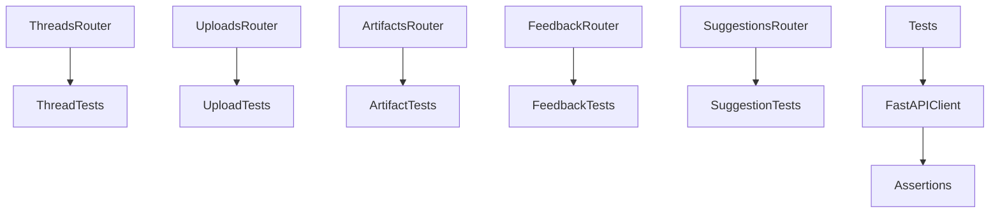
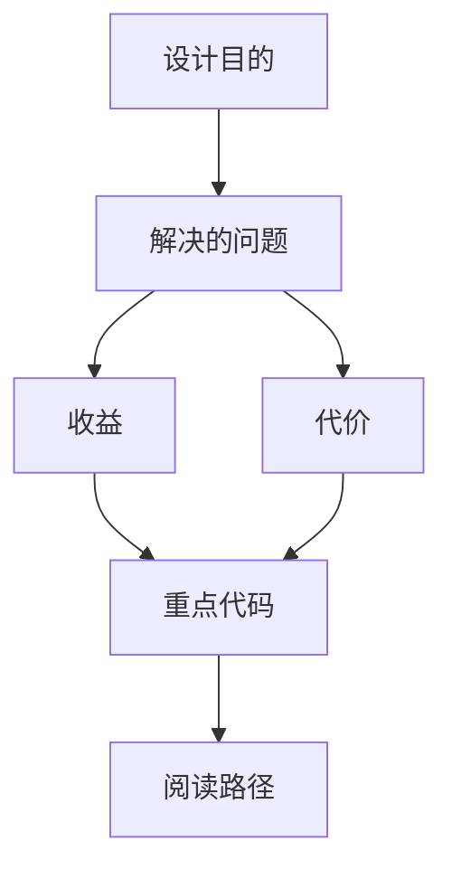

<title>204｜Threads / Uploads / Artifacts Router 测试详解</title>

<callout emoji="✅">
**本章目标：**继续拆单测试族、单规格文档和根文档模块。
</callout>

| 模块点 | 说明 |
|-|-|
| test_threads_router.py | thread CRUD/state/history。 |
| test_uploads_router.py | uploads API。 |
| test_artifacts_router.py | artifact API。 |
| test_feedback.py | feedback API。 |
| test_suggestions_router.py | suggestions API。 |

---

# 补充：设计取舍、重点代码与阅读路径

<callout emoji="💡">
**设计目的：**这组测试保护 Gateway router 的 HTTP 契约：thread CRUD/state/history、uploads 限制与路径安全、artifact 预览/下载、feedback 和 suggestions。
</callout>

| 维度 | 说明 |
|-|-|
| 收益 | 浏览器/API 客户端依赖的状态码、响应字段、owner check 和路径安全行为可稳定回归。 |
| 代价 | 一个请求可能同时经过 authz、router、manager/repository、filesystem helper 和 runtime state。 |
| 重点代码 | `backend/app/gateway/routers/threads.py`、`backend/app/gateway/routers/uploads.py`、`backend/app/gateway/routers/artifacts.py`、`backend/app/gateway/routers/feedback.py`、`backend/app/gateway/routers/suggestions.py`，以及对应 `backend/tests/test_*_router.py`。 |
| 阅读路径 | 先看 route path 与 response model，再追 manager/repository/filesystem helper，最后核对测试中的 status code、owner isolation 和安全断言。 |

