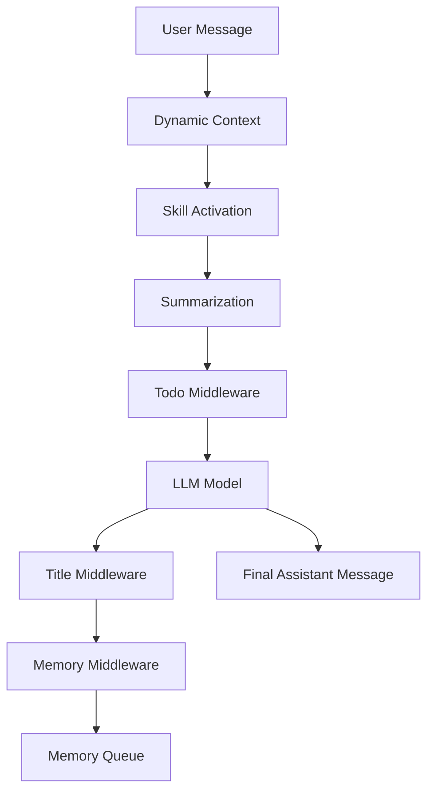
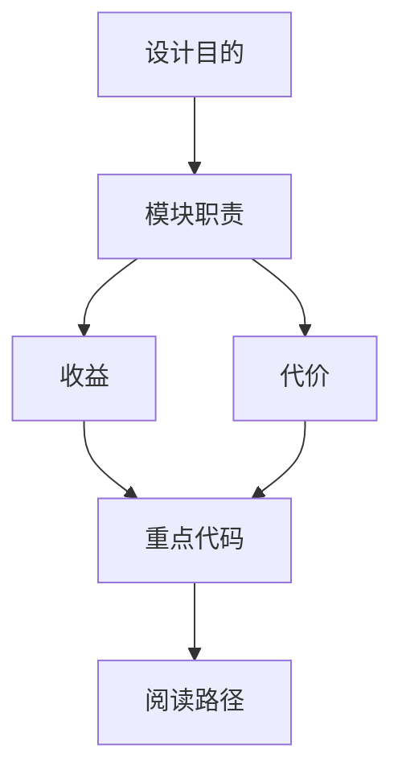

<title>20｜Middleware 上下文与 UX 类文件详解：Dynamic、Skill、Summary、Todo、Title、Memory</title>

<callout emoji="✅">
**本章目标：**把影响 prompt、上下文、标题、Todo、长期记忆的 middleware 拆开讲。
</callout>

# 1. 模块职责

| 文件 | 职责 | 用户可见影响 |
|-|-|-|
| `dynamic_context_middleware.py` | 注入当前日期、memory reminder 等动态上下文 | 回答会带当前日期和个性化上下文。 |
| `skill_activation_middleware.py` | 识别 /skill-name 并读取完整 SKILL.md | 显式 skill 激活更稳定。 |
| `summarization_middleware.py` | 上下文接近限制时摘要，并保护 skill 内容 | 长对话不容易爆上下文。 |
| `todo_middleware.py` | plan mode 中维护任务列表 | 前端 TodoList 展示进度。 |
| `title_middleware.py` | 生成会话标题 | 侧边栏 thread title。 |
| `memory_middleware.py` | after_agent 入队更新长期记忆 | 后续对话更个性化。 |

# 2. 上下文注入与更新链路

# 3. 调试建议

- skill 没生效：查 slash 解析和 available_skills。
- Todo 不显示：检查 is_plan_mode 和 `todos` state。
- 标题不更新：看 TitleMiddleware 模型调用和 thread meta 同步。
- memory 污染：看 message_processing 和 updater 的过滤规则。

## 补充：Context 与 UX Middleware 简化运行图

---

# 补充：设计取舍、重点代码与阅读路径

<callout emoji="💡">
**设计目的：**该文档用于把模块职责、运行逻辑、关键代码和阅读路径固定下来，帮助读者从源码验证行为。
</callout>

| 维度 | 说明 |
|-|-|
| 收益 | 读者可以按文档快速定位模块入口和上下游关系。 |
| 代价 | 文档需要随源码变更持续校准，避免模板化描述掩盖真实行为。 |
| 重点代码 | 标题对应的源码、测试或文档入口。 |
| 阅读路径 | 先看上游输入，再看核心函数，最后看下游输出和测试验证。 |

