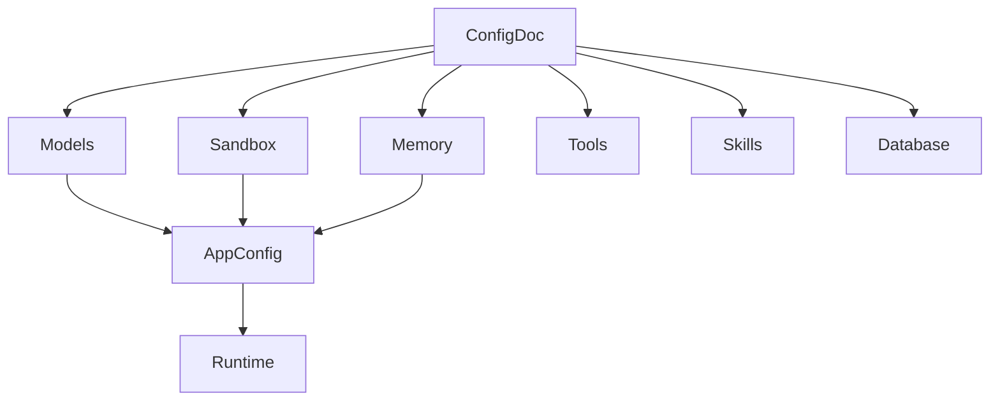
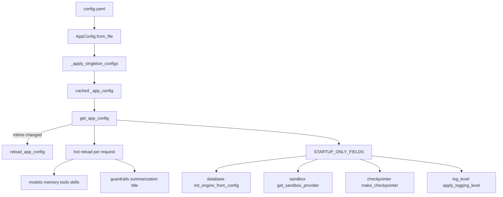

<title>210｜backend/docs/CONFIGURATION.md 详解</title>

<callout emoji="✅">
**本章目标：**继续把 backend/docs 中重要说明拆成独立讲解文档。
</callout>

| 文档点 | 说明 |
|-|-|
| models | 模型配置。 |
| sandbox | Local/Aio/provisioner sandbox。 |
| memory | 长期记忆配置。 |
| MCP/tools/skills | 扩展能力配置。 |
| reload boundary | 热加载和重启边界。 |

---

# 补充：设计取舍、重点代码与阅读路径

<callout emoji="💡">
**设计目的：**该文档说明工程脚本、测试、部署或运行时辅助模块的职责、调用入口和验证方式，避免把流程知识只留在脚本里。
</callout>

| 维度 | 说明 |
|-|-|
| 收益 | 新同学能按脚本/测试入口复现工程流程，并知道失败时应检查哪个阶段。 |
| 代价 | 脚本和 CI 逻辑容易随依赖或平台变化漂移，需要用命令和源码双重验证。 |
| 重点代码 | 文档标题对应的 `scripts/`、`docker/`、`backend/tests/`、`frontend/tests/` 或 `docs/` 文件。 |
| 阅读路径 | 先看入口命令，再看脚本调用链，最后看测试或日志如何证明行为。 |

