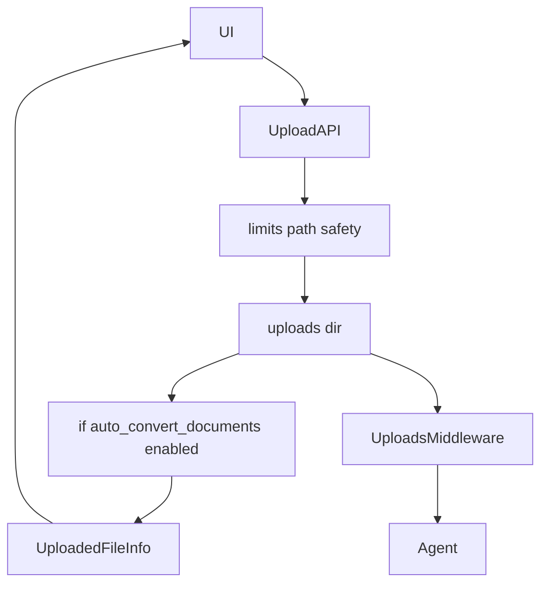
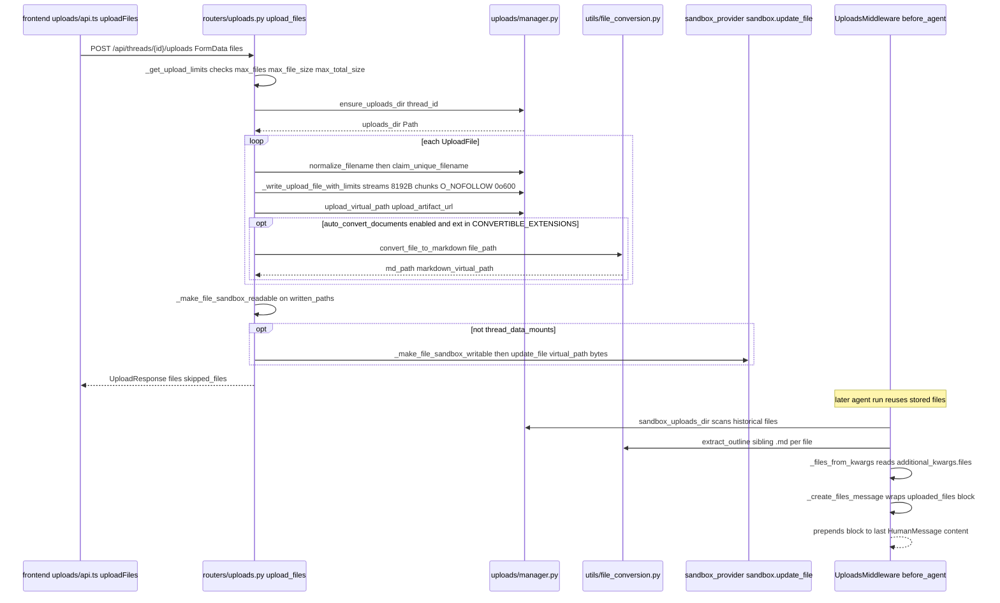

<title>213｜backend/docs/FILE_UPLOAD.md 详解</title>

<callout emoji="✅">
**本章目标：**继续把 backend/docs 中重要说明拆成独立讲解文档。
</callout>

| 文档点 | 说明 |
|-|-|
| upload API | /api/threads/{id}/uploads。 |
| conversion | PDF/Office 在显式启用 `uploads.auto_convert_documents: true` 后才自动转 Markdown；默认关闭以避免在 Gateway 主机解析不受信任文件。 |
| virtual path | /mnt/user-data/uploads。 |
| UploadsMiddleware | 注入 uploaded_files 上下文。 |
| Artifacts | 上传文件也可通过 artifact URL 访问。 |

---

# 补充：设计取舍、重点代码与阅读路径

<callout emoji="💡">
**设计目的：**这个模块以 API/边界层拆分，是为了隔离 HTTP 协议、认证鉴权、请求模型和内部业务。
</callout>

| 维度 | 说明 |
|-|-|
| 收益 | 收益是前后端契约清晰，接口可独立演进。 |
| 代价 | 代价是一次功能可能跨 router、service、repository 和前端 hook。 |
| 重点代码 | 重点代码在 `backend/app/gateway/routers/`、`backend/app/gateway/auth/*` 或对应前端 `frontend/src/core/*/api.ts`。 |
| 阅读路径 | 阅读路径：从 URL/API 入口往内追 service，再看数据落到哪里。 |

