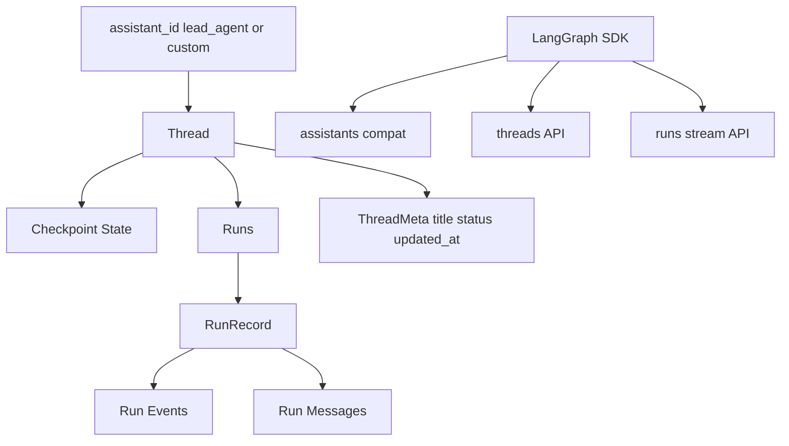
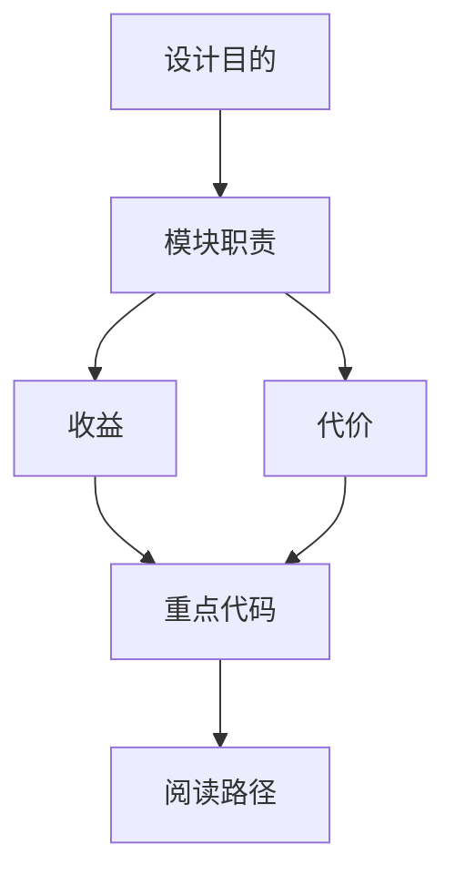

<title>21｜Run 与 Thread Router 文件级详解</title>

<callout emoji="✅">
**本章目标：**聚焦 thread_runs.py、runs.py、threads.py、assistants_compat.py，讲清 LangGraph-compatible API 表面。
</callout>

# 1. API 分组

| 文件 | 接口组 | 职责 |
|-|-|-|
| `backend/app/gateway/routers/thread_runs.py` | `/api/threads/{thread_id}/runs*` | 有 thread 的 run create/stream/wait/cancel/join/messages/events/token usage。 |
| `backend/app/gateway/routers/runs.py` | `/api/runs/*` | stateless stream/wait，自动创建或复用 thread。 |
| `backend/app/gateway/routers/threads.py` | `/api/threads*` | thread create/search/patch/get/state/history/delete。 |
| `backend/app/gateway/routers/assistants_compat.py` | `/api/assistants*` | 满足 LangGraph SDK 初始化需要，assistant_id 映射到 lead_agent。 |

# 2. Thread 与 Run 关系图



# 3. 典型请求

```text
POST /api/threads
POST /api/threads/search
GET  /api/threads/{thread_id}/state
POST /api/threads/{thread_id}/runs/stream
GET  /api/threads/{thread_id}/runs/{run_id}/join
POST /api/runs/stream
```

# 4. 风险点

- metadata 中 user_id/owner_id 属于服务端保留字段，threads.py 会剥离。
- run stream 需要处理 inactive worker 409，前端 api-client 有兼容逻辑。
- assistant_id 自定义 agent 实际仍通过 lead_agent graph 加 agent_name。

---

# 补充：设计取舍、重点代码与阅读路径

<callout emoji="💡">
**设计目的：**该文档用于把模块职责、运行逻辑、关键代码和阅读路径固定下来，帮助读者从源码验证行为。
</callout>

| 维度 | 说明 |
|-|-|
| 收益 | 读者可以按文档快速定位模块入口和上下游关系。 |
| 代价 | 文档需要随源码变更持续校准，避免模板化描述掩盖真实行为。 |
| 重点代码 | 标题对应的源码、测试或文档入口。 |
| 阅读路径 | 先看上游输入，再看核心函数，最后看下游输出和测试验证。 |


