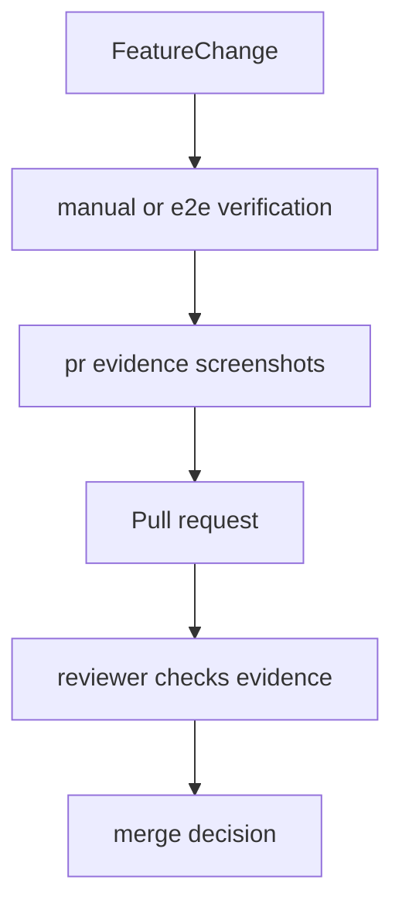

<title>222｜docs/pr-evidence 证据材料详解</title>

<callout emoji="✅">
**本章目标：**继续拆 backend/docs 与项目文档模块，说明用途和关联代码。
</callout>

| 文档点 | 说明 |
|-|-|
| docs/pr-evidence | PR 截图/证据目录。 |
| session-skill-manage-e2e | skill manage E2E 证据。 |
| skill-manage-e2e | 技能管理页面证据。 |
| 用途 | PR review 验证 UI/功能。 |

