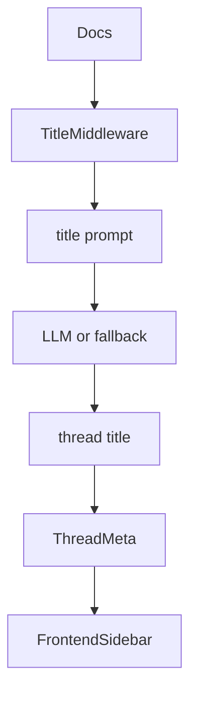

<title>223｜AUTO_TITLE / TITLE_GENERATION 文档单独详解</title>

<callout emoji="✅">
**本章目标：**继续拆剩余文档/content 模块，说明用途和关联运行逻辑。
</callout>

| 模块点 | 说明 |
|-|-|
| AUTO_TITLE_GENERATION.md | 自动标题功能说明。 |
| TITLE_GENERATION_IMPLEMENTATION.md | 实现细节。 |
| TitleMiddleware | 核心实现。 |
| Thread meta sync | run 收尾同步到会话列表。 |

