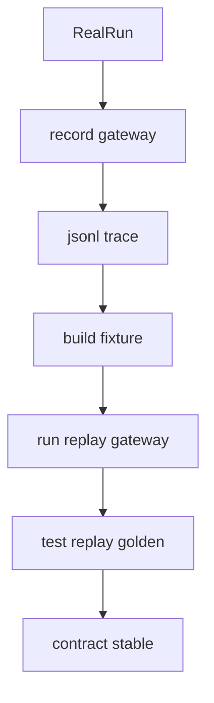
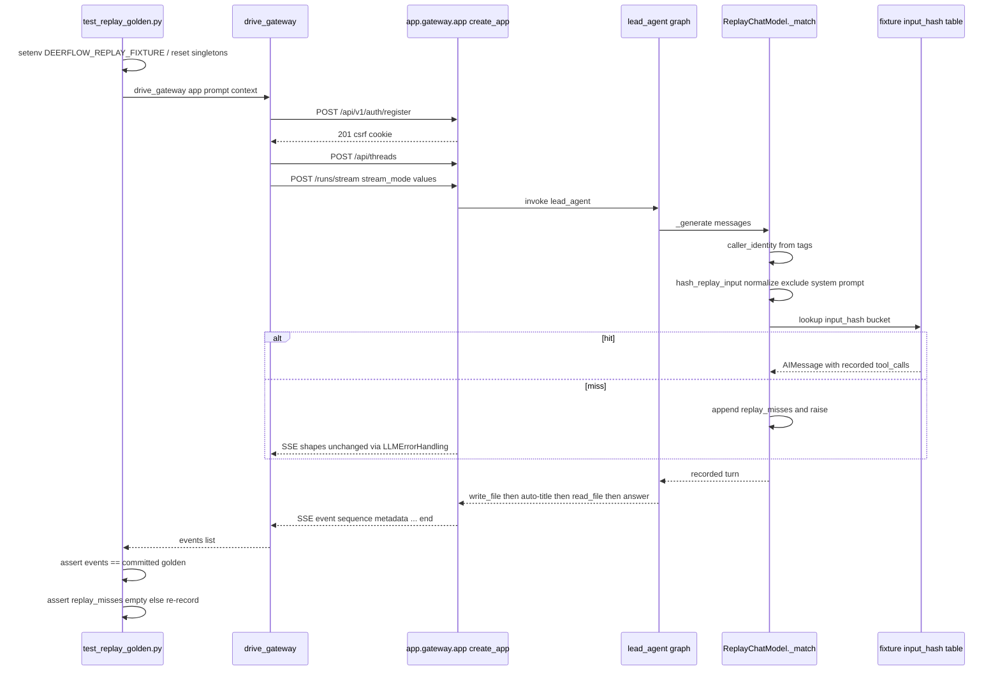

<title>224｜REPLAY_E2E 文档单独详解</title>

<callout emoji="✅">
**本章目标：**继续拆剩余文档/content 模块，说明用途和关联运行逻辑。
</callout>

| 模块点 | 说明 |
|-|-|
| REPLAY_E2E.md | 回放 E2E 指南。 |
| record_gateway.py | 录制 gateway。 |
| run_replay_gateway.py | 回放 gateway。 |
| build_fixture_from_jsonl.py | 构建 fixture。 |
| test_replay_golden.py | golden 测试。 |

---

# 补充：设计取舍、重点代码与阅读路径

<callout emoji="💡">
**设计目的：**Replay E2E 用 key-free fixture 固定跨栈协议与渲染合同，避免真实模型、网络和密钥波动影响回归。
</callout>

| 维度 | 说明 |
|-|-|
| 收益 | backend SSE golden 与 full-stack render 分层验证，能分别捕获协议漂移和前端渲染漂移。 |
| 代价 | fixture 与真实录制需要维护；hash miss、multi-run order、无 checkpoint 场景必须显式失败而不是静默通过。 |
| 重点代码 | `backend/docs/REPLAY_E2E.md`、`backend/tests/replay_provider.py`、`backend/scripts/run_replay_gateway.py`、`backend/tests/test_replay_golden.py`、`frontend/tests/e2e-real-backend/`。 |
| 阅读路径 | 先读 REPLAY_E2E.md 的两层验证模型，再看 record/build fixture，最后跑 backend golden 与 real-backend Playwright。 |

