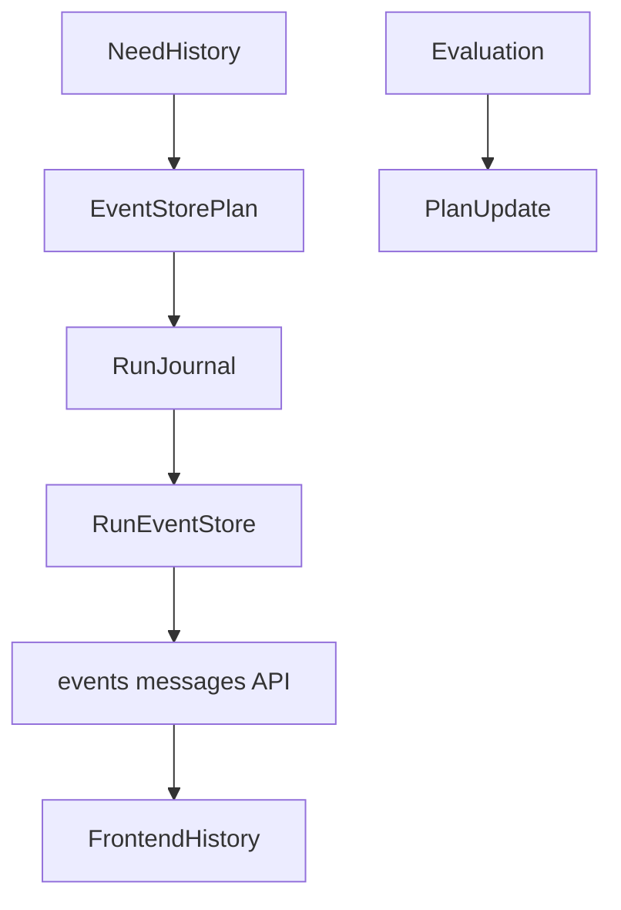
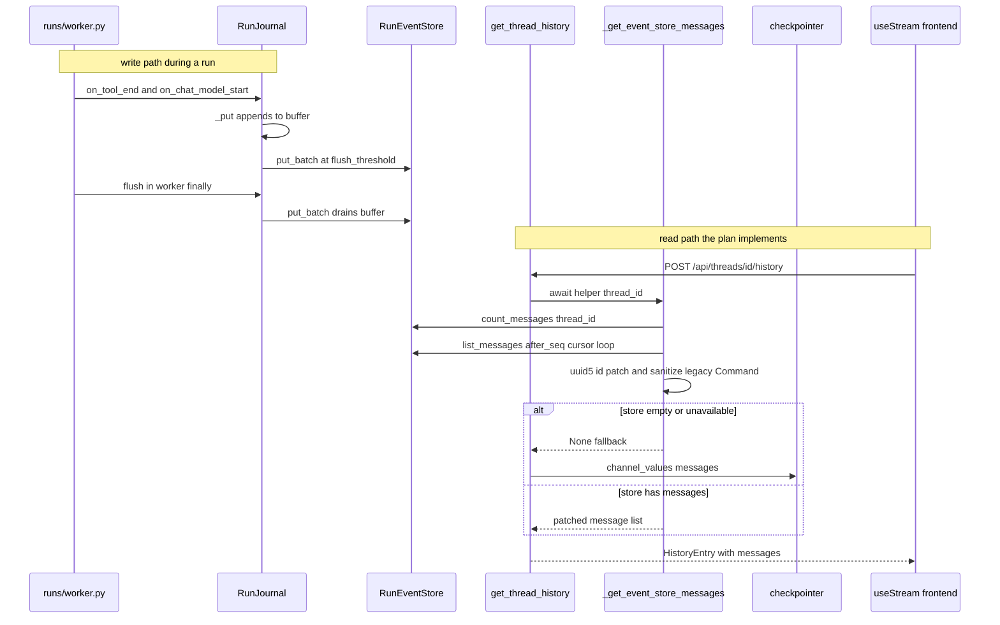

<title>234｜Event Store History Plan 单文件详解</title>

<callout emoji="✅">
**本章目标：**继续细化 content/spec/docs 单模块，补充运行/维护逻辑图。
</callout>

| 模块点 | 说明 |
|-|-|
| plan | 2026-04-10-event-store-history.md。 |
| evaluation | 2026-04-11-runjournal-history-evaluation.md。 |
| 目标 | run event/history 可观测。 |
| 关联 | RunJournal、RunEventStore、frontend history。 |

---

# 补充：设计取舍、重点代码与阅读路径

<callout emoji="💡">
**设计目的：**该模块用于固化工程流程、质量门禁或设计背景，是为了让行为可复现、可审计。
</callout>

| 维度 | 说明 |
|-|-|
| 收益 | 收益是降低回归风险，帮助新人理解历史决策。 |
| 代价 | 代价是容易与代码实现漂移，需要持续维护。 |
| 重点代码 | 重点代码/资料是对应 tests、scripts、workflow、docs 文件及其调用的源码入口。 |
| 阅读路径 | 阅读路径：按输入、执行步骤、输出证据三段看。 |

