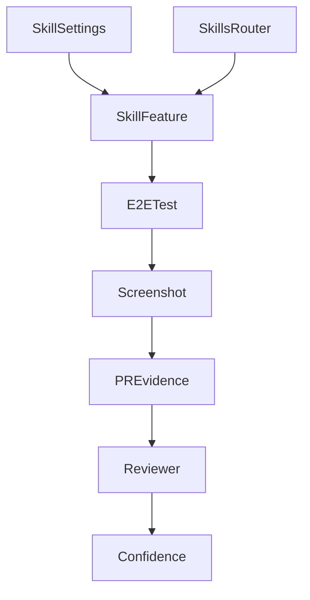

<title>241｜Skill Manage PR Evidence 详解</title>

<callout emoji="✅">
**本章目标：**继续细化 content/docs/evidence 模块并给出维护逻辑图。
</callout>

| 模块点 | 说明 |
|-|-|
| skill-manage-e2e screenshot | 技能管理 E2E 截图。 |
| session-skill-manage-e2e screenshot | 会话技能管理截图。 |
| 用途 | 证明 UI/功能回归通过。 |
| 关联 | skills router、settings skill page、artifact install。 |

