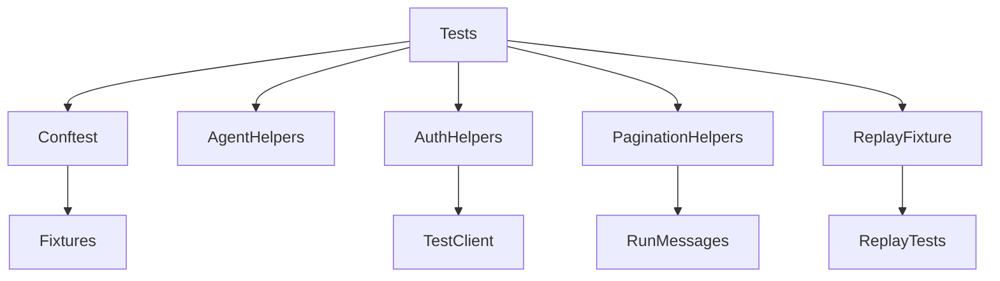
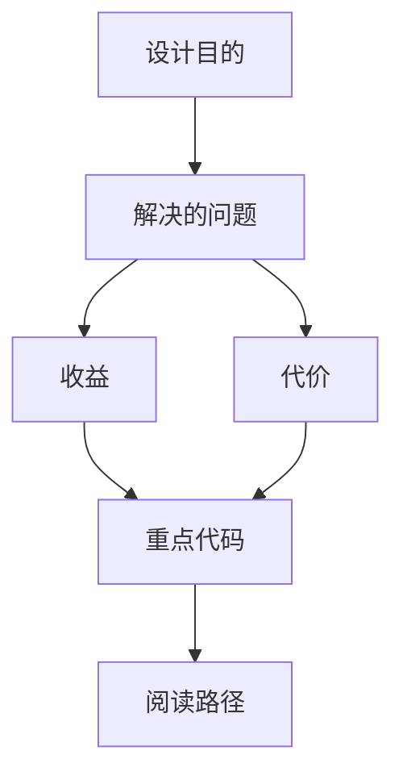
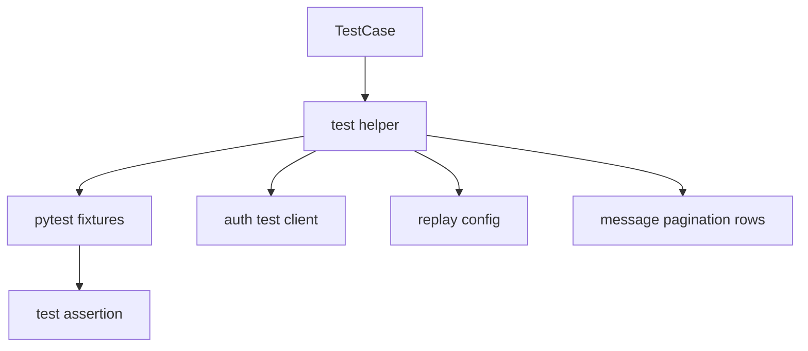

<title>244｜Backend Test Helpers / Fixtures 详解</title>

<callout emoji="✅">
**本章目标：**继续拆测试 helper、fixtures、frontend content 支持模块。
</callout>

| 模块点 | 说明 |
|-|-|
| \_agent_e2e_helpers.py | agent E2E 辅助。 |
| \_router_auth_helpers.py | router auth 测试辅助。 |
| \_run_message_pagination_helpers.py | run message 分页辅助。 |
| \_replay_fixture.py | replay fixture 辅助。 |
| conftest.py | pytest 全局 fixture。 |

---

# 补充：设计取舍、重点代码与阅读路径

<callout emoji="💡">
**设计目的：**这些文件是测试支撑层，用统一 fixture、auth client、replay config 和 pagination helpers 降低测试重复代码。
</callout>

| 维度 | 说明 |
|-|-|
| 收益 | Router、agent E2E、replay 和 pagination 测试能共享稳定造数和断言入口。 |
| 代价 | helper 变化会影响大量测试，必须保持测试意图清晰，避免把生产逻辑藏进 fixture。 |
| 重点代码 | `backend/tests/conftest.py`、`backend/tests/_agent_e2e_helpers.py`、`backend/tests/_router_auth_helpers.py`、`backend/tests/_run_message_pagination_helpers.py`、`backend/tests/_replay_fixture.py`。 |
| 阅读路径 | 先看具体测试如何调用 helper，再回到 helper 看其准备的 app、auth、store、fixture 或断言。 |

