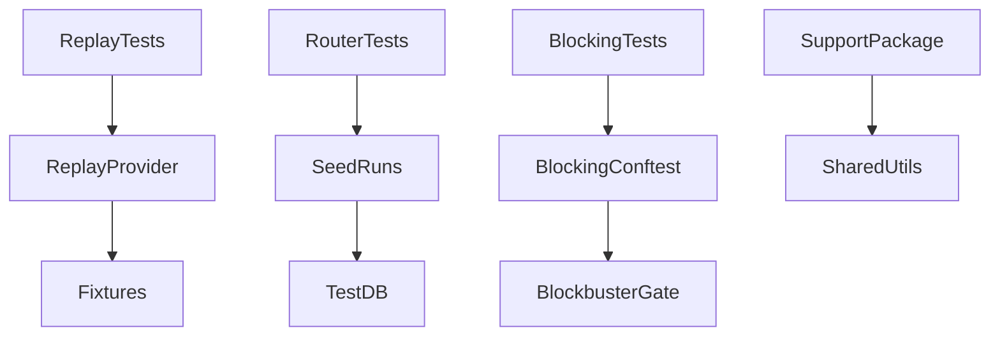
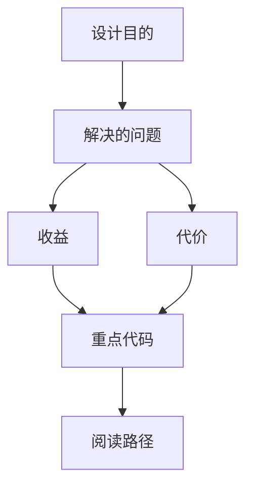
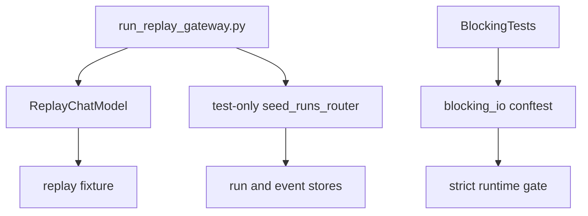

<title>245｜Backend Replay Provider / Seed / Support 测试模块详解</title>

<callout emoji="✅">
**本章目标：**继续拆测试 helper、fixtures、frontend content 支持模块。
</callout>

| 模块点 | 说明 |
|-|-|
| replay_provider.py | replay provider 测试支持。 |
| seed_runs_router.py | run router seed 数据。 |
| support/\_\_init\_\_.py | 测试 support package。 |
| blocking_io/conftest.py | 阻塞 IO 测试 fixture。 |

---

# 补充：设计取舍、重点代码与阅读路径

<callout emoji="💡">
**设计目的：**该模块为 replay E2E、test-only seeding、共享测试 support 和 blocking IO runtime gate 提供后端测试基础设施。
</callout>

| 维度 | 说明 |
|-|-|
| 收益 | replay provider 保证无 key 回放；seed router 能构造真实 run/event store 场景；Blockbuster gate 防止阻塞 IO 回归。 |
| 代价 | test-only router 必须只在 replay/test 环境挂载，blocking gate 需要和实际异步边界保持同步。 |
| 重点代码 | `backend/tests/replay_provider.py`、`backend/tests/seed_runs_router.py`、`backend/tests/support/`、`backend/tests/blocking_io/conftest.py`、`backend/scripts/run_replay_gateway.py`。 |
| 阅读路径 | 先从 replay gateway 如何挂载 provider/seed router 入手，再看 provider 的 hash 匹配，最后看 blocking_io conftest 如何启用 strict gate。 |

