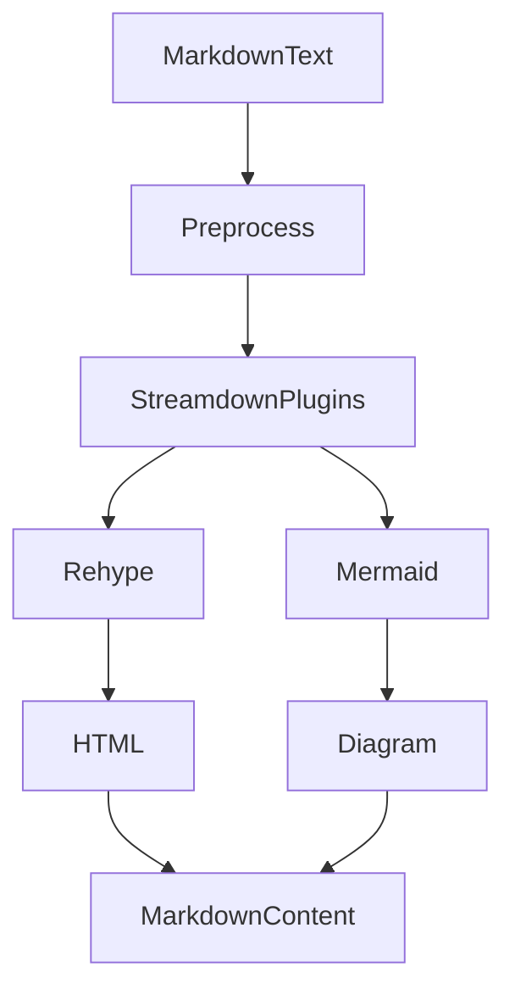

<title>250｜Frontend Rehype / Streamdown / Mermaid 细节详解</title>

<callout emoji="✅">
**本章目标：**继续拆测试 helper、fixtures、frontend content 支持模块。
</callout>

| 模块点 | 说明 |
|-|-|
| core/rehype | rehype plugin 封装。 |
| core/streamdown/mermaid.ts | Mermaid 处理。 |
| plugins.ts | Markdown 插件。 |
| preprocess.ts | 内容预处理。 |
| components/workspace/messages/markdown-content.tsx | 渲染入口。 |

