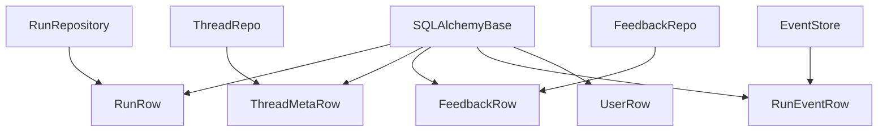

<title>251｜Persistence Run/Thread/Feedback Models 详解</title>

<callout emoji="✅">
**本章目标：**补齐 persistence/runtime/frontend 基础设施模块。
</callout>

| 模块点 | 说明 |
|-|-|
| run/model.py | RunRow 表。 |
| thread_meta/model.py | ThreadMetaRow 表。 |
| feedback/model.py | FeedbackRow 表。 |
| models/run_event.py | RunEventRow 表。 |
| user/model.py | UserRow 表。 |

