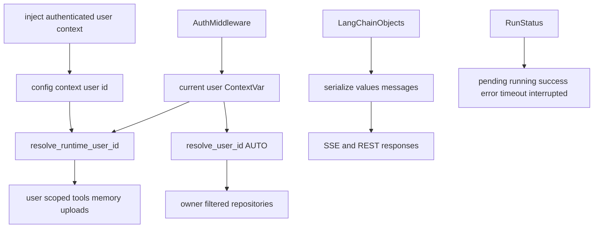
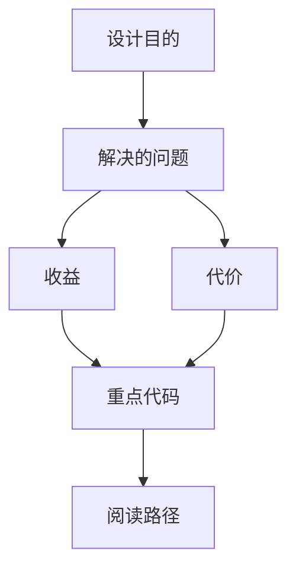

<title>254｜Runtime UserContext、Converters、Serialization 详解</title>

<callout emoji="✅">
**本章目标：**补齐 persistence/runtime/frontend 基础设施模块。
</callout>

| 模块点 | 说明 |
|-|-|
| `runtime/user_context.py` | 保存 request-scoped `ContextVar`，并提供 repository `AUTO` 与 runtime effective user 两套解析语义。 |
| Repository `AUTO` | `resolve_user_id(AUTO)` 从 ContextVar 取用户；未设置时抛 `RuntimeError`；显式 `None` 才跳过 owner filter。 |
| Runtime effective user | `resolve_runtime_user_id(runtime)` 先读 `runtime.context['user_id']`，再读 ContextVar，最后回退 `DEFAULT_USER_ID`。 |
| `runtime/converters.py` | LangChain message 转 OpenAI-compatible message/completion。 |
| `runtime/serialization.py` | SSE/REST 响应的 canonical serialization，`values` 模式过滤内部 LangGraph key。 |
| `runtime/runs/schemas.py` | `RunStatus` 与 `DisconnectMode` 生命周期枚举。 |

---

# 补充：设计取舍、重点代码与阅读路径

<callout emoji="💡">
**设计目的：**前端按 route、core 数据层、业务组件、UI primitive 分层，是为了降低组件耦合。
</callout>

| 维度 | 说明 |
|-|-|
| 收益 | 收益是展示层和数据请求分离，组件更容易复用。 |
| 代价 | 代价是一次用户交互常跨页面、hook、缓存、上下文和组件。 |
| 重点代码 | 重点代码在 `frontend/src/app`、`frontend/src/core`、`frontend/src/components` 对应模块。 |
| 阅读路径 | 阅读路径：先找 route，再找 hook 数据源，最后看组件消费。 |

