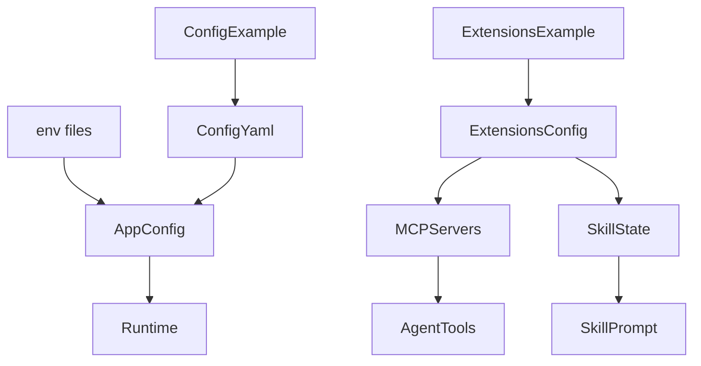

<title>257｜Root Config Files 详解：config.yaml、extensions、env</title>

<callout emoji="✅">
**本章目标：**补齐 persistence/runtime/frontend 基础设施模块。
</callout>

| 模块点 | 说明 |
|-|-|
| config.example.yaml | 主配置模板。 |
| config.yaml | 本地真实配置。 |
| extensions_config.example.json | MCP/skills 状态模板。 |
| extensions_config.json | 本地扩展配置。 |
| .env/.env.example | 环境变量和 API key。 |

